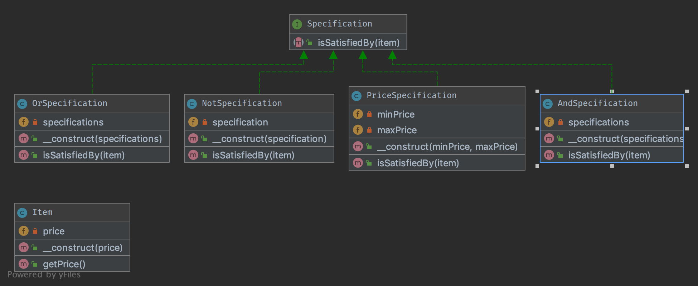

# Специфікація (Specification)

## Призначення

Будує зрозумілий опис бізнес-правил, на відповідність яким можуть бути перевірені об'єкти. Композитний клас 
специфікації має один метод, званий `isSatisfiedBy`, який повертає true або false в залежно від того, чи задовольняє 
даний об’єкт специфікації.

## Приклади

[ RulerZ](https://github.com/K-Phoen/rulerz)

## Діаграма UML



## Код
Ви можете знайти цей код на [GitHub](https://github.com/PetroOstapuk/DesignPatternsPHP/tree/main/Behavioral/Specification)

```php title="Item.php"
<?php

declare(strict_types=1);

namespace DesignPatterns\Behavioral\Specification;

class Item
{
    public function __construct(private float $price)
    {
    }

    public function getPrice(): float
    {
        return $this->price;
    }
}
```

```php title="Specification.php"
<?php

declare(strict_types=1);

namespace DesignPatterns\Behavioral\Specification;

interface Specification
{
    public function isSatisfiedBy(Item $item): bool;
}
```

```php title="OrSpecification.php"
<?php

declare(strict_types=1);

namespace DesignPatterns\Behavioral\Specification;

class OrSpecification implements Specification
{
    /**
     * @var Specification[]
     */
    private array $specifications;

    /**
     * @param Specification[] $specifications
     */
    public function __construct(Specification ...$specifications)
    {
        $this->specifications = $specifications;
    }

    /*
     * if at least one specification is true, return true, else return false
     */
    public function isSatisfiedBy(Item $item): bool
    {
        foreach ($this->specifications as $specification) {
            if ($specification->isSatisfiedBy($item)) {
                return true;
            }
        }

        return false;
    }
}
```

```php title="PriceSpecification.php"
<?php

declare(strict_types=1);

namespace DesignPatterns\Behavioral\Specification;

class PriceSpecification implements Specification
{
    public function __construct(private ?float $minPrice, private ?float $maxPrice)
    {
    }

    public function isSatisfiedBy(Item $item): bool
    {
        if ($this->maxPrice !== null && $item->getPrice() > $this->maxPrice) {
            return false;
        }

        if ($this->minPrice !== null && $item->getPrice() < $this->minPrice) {
            return false;
        }

        return true;
    }
}
```

```php title="AndSpecification.php"
<?php

declare(strict_types=1);

namespace DesignPatterns\Behavioral\Specification;

class AndSpecification implements Specification
{
    /**
     * @var Specification[]
     */
    private array $specifications;

    /**
     * @param Specification[] $specifications
     */
    public function __construct(Specification ...$specifications)
    {
        $this->specifications = $specifications;
    }

    /**
     * if at least one specification is false, return false, else return true.
     */
    public function isSatisfiedBy(Item $item): bool
    {
        foreach ($this->specifications as $specification) {
            if (!$specification->isSatisfiedBy($item)) {
                return false;
            }
        }

        return true;
    }
}
```

```php title="NotSpecification.php"
<?php

declare(strict_types=1);

namespace DesignPatterns\Behavioral\Specification;

class NotSpecification implements Specification
{
    public function __construct(private Specification $specification)
    {
    }

    public function isSatisfiedBy(Item $item): bool
    {
        return !$this->specification->isSatisfiedBy($item);
    }
}
```

## Тест

```php title="Tests/SpecificationTest.php"
<?php

declare(strict_types=1);

namespace DesignPatterns\Behavioral\Specification\Tests;

use DesignPatterns\Behavioral\Specification\Item;
use DesignPatterns\Behavioral\Specification\NotSpecification;
use DesignPatterns\Behavioral\Specification\OrSpecification;
use DesignPatterns\Behavioral\Specification\AndSpecification;
use DesignPatterns\Behavioral\Specification\PriceSpecification;
use PHPUnit\Framework\TestCase;

class SpecificationTest extends TestCase
{
    public function testCanOr()
    {
        $spec1 = new PriceSpecification(50, 99);
        $spec2 = new PriceSpecification(101, 200);

        $orSpec = new OrSpecification($spec1, $spec2);

        $this->assertFalse($orSpec->isSatisfiedBy(new Item(100)));
        $this->assertTrue($orSpec->isSatisfiedBy(new Item(51)));
        $this->assertTrue($orSpec->isSatisfiedBy(new Item(150)));
    }

    public function testCanAnd()
    {
        $spec1 = new PriceSpecification(50, 100);
        $spec2 = new PriceSpecification(80, 200);

        $andSpec = new AndSpecification($spec1, $spec2);

        $this->assertFalse($andSpec->isSatisfiedBy(new Item(150)));
        $this->assertFalse($andSpec->isSatisfiedBy(new Item(1)));
        $this->assertFalse($andSpec->isSatisfiedBy(new Item(51)));
        $this->assertTrue($andSpec->isSatisfiedBy(new Item(100)));
    }

    public function testCanNot()
    {
        $spec1 = new PriceSpecification(50, 100);
        $notSpec = new NotSpecification($spec1);

        $this->assertTrue($notSpec->isSatisfiedBy(new Item(150)));
        $this->assertFalse($notSpec->isSatisfiedBy(new Item(50)));
    }
}
``` 