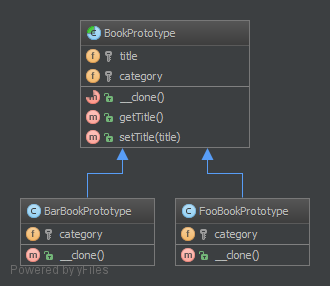

# Прототип (Prototype)

## Призначення

Допомагає уникнути витрат на створення об'єктів у стандартний спосіб (new Foo()), 
а натомість створює прототип і потім клонує його.

## Приклади

Великі обсяги даних (наприклад, створити 1000000 рядків у базі даних відразу через ORM).

## Діаграма UML



## Код
Ви можете знайти цей код на [GitHub](https://github.com/PetroOstapuk/DesignPatternsPHP/tree/main/Creational/Prototype)

```php title="BookPrototype.php"
<?php

declare(strict_types=1);

namespace DesignPatterns\Creational\Prototype;

abstract class BookPrototype
{
    protected string $title;
    protected string $category;

    abstract public function __clone();

    final public function getTitle(): string
    {
        return $this->title;
    }

    final public function setTitle(string $title): void
    {
        $this->title = $title;
    }
}
```

```php title="BarBookPrototype.php"
<?php

declare(strict_types=1);

namespace DesignPatterns\Creational\Prototype;

class BarBookPrototype extends BookPrototype
{
    protected string $category = 'Bar';

    public function __clone()
    {
    }
}
```

```php title="FooBookPrototype.php"
<?php

declare(strict_types=1);

namespace DesignPatterns\Creational\Prototype;

class FooBookPrototype extends BookPrototype
{
    protected string $category = 'Foo';

    public function __clone()
    {
    }
}
```

## Тест

```php title="Tests/PrototypeTest.php"
<?php

declare(strict_types=1);

namespace DesignPatterns\Creational\Prototype\Tests;

use DesignPatterns\Creational\Prototype\BarBookPrototype;
use DesignPatterns\Creational\Prototype\FooBookPrototype;
use PHPUnit\Framework\TestCase;

class PrototypeTest extends TestCase
{
    public function testCanGetFooBook()
    {
        $fooPrototype = new FooBookPrototype();
        $barPrototype = new BarBookPrototype();

        for ($i = 0; $i < 10; $i++) {
            $book = clone $fooPrototype;
            $book->setTitle('Foo Book No ' . $i);
            $this->assertInstanceOf(FooBookPrototype::class, $book);
        }

        for ($i = 0; $i < 5; $i++) {
            $book = clone $barPrototype;
            $book->setTitle('Bar Book No ' . $i);
            $this->assertInstanceOf(BarBookPrototype::class, $book);
        }
    }
}
```