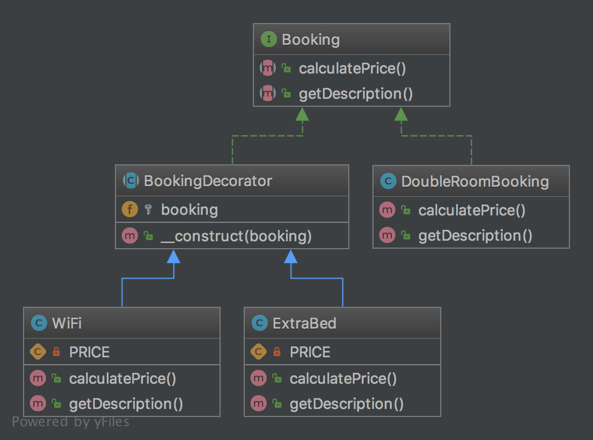

# Декоратор (Decorator)

## Призначення

Динамічно додає нову функціональність до екземплярів класів.

## Приклади

Web Service Layer: Декоратори JSON та XML для REST сервісів (у цьому випадку, Звичайно, тільки один з них може 
бути дозволений).

## Діаграма UML



## Код

Ви можете знайти цей код на [GitHub](https://github.com/PetroOstapuk/DesignPatternsPHP/tree/main/Structural/Decorator)

```php title="Booking.php"
<?php

declare(strict_types=1);

namespace DesignPatterns\Structural\Decorator;

interface Booking
{
    public function calculatePrice(): int;

    public function getDescription(): string;
}
```

```php title="BookingDecorator.php"
<?php

declare(strict_types=1);

namespace DesignPatterns\Structural\Decorator;

abstract class BookingDecorator implements Booking
{
    public function __construct(protected Booking $booking)
    {
    }
}
```

```php title="DoubleRoomBooking.php"
<?php

declare(strict_types=1);

namespace DesignPatterns\Structural\Decorator;

class DoubleRoomBooking implements Booking
{
    public function calculatePrice(): int
    {
        return 40;
    }

    public function getDescription(): string
    {
        return 'double room';
    }
}
```

```php title="ExtraBed.php"
<?php

declare(strict_types=1);

namespace DesignPatterns\Structural\Decorator;

class ExtraBed extends BookingDecorator
{
    private const PRICE = 30;

    public function calculatePrice(): int
    {
        return $this->booking->calculatePrice() + self::PRICE;
    }

    public function getDescription(): string
    {
        return $this->booking->getDescription() . ' with extra bed';
    }
}
```

```php title="WiFi.php"
<?php

declare(strict_types=1);

namespace DesignPatterns\Structural\Decorator;

class WiFi extends BookingDecorator
{
    private const PRICE = 2;

    public function calculatePrice(): int
    {
        return $this->booking->calculatePrice() + self::PRICE;
    }

    public function getDescription(): string
    {
        return $this->booking->getDescription() . ' with wifi';
    }
}
```

## Тест

```php title="Tests/DecoratorTest.php"
<?php

declare(strict_types=1);

namespace DesignPatterns\Structural\Decorator\Tests;

use DesignPatterns\Structural\Decorator\DoubleRoomBooking;
use DesignPatterns\Structural\Decorator\ExtraBed;
use DesignPatterns\Structural\Decorator\WiFi;
use PHPUnit\Framework\TestCase;

class DecoratorTest extends TestCase
{
    public function testCanCalculatePriceForBasicDoubleRoomBooking()
    {
        $booking = new DoubleRoomBooking();

        $this->assertSame(40, $booking->calculatePrice());
        $this->assertSame('double room', $booking->getDescription());
    }

    public function testCanCalculatePriceForDoubleRoomBookingWithWiFi()
    {
        $booking = new DoubleRoomBooking();
        $booking = new WiFi($booking);

        $this->assertSame(42, $booking->calculatePrice());
        $this->assertSame('double room with wifi', $booking->getDescription());
    }

    public function testCanCalculatePriceForDoubleRoomBookingWithWiFiAndExtraBed()
    {
        $booking = new DoubleRoomBooking();
        $booking = new WiFi($booking);
        $booking = new ExtraBed($booking);

        $this->assertSame(72, $booking->calculatePrice());
        $this->assertSame('double room with wifi with extra bed', $booking->getDescription());
    }
}
```