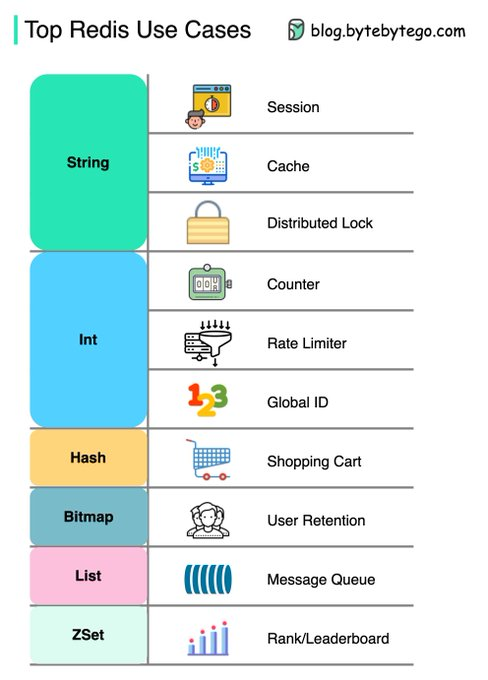

# Redis

Більшість людей думають, що Redis призначений лише для кешування.

Але він може набагато більше. Redis добре підходить для:

- Сховища сесій
- Розподіленого блокування
- Лічильників
- Обмежувача швидкості
- Рейтингу/таблиці лідерів
- Черги повідомлень
- тощо.

