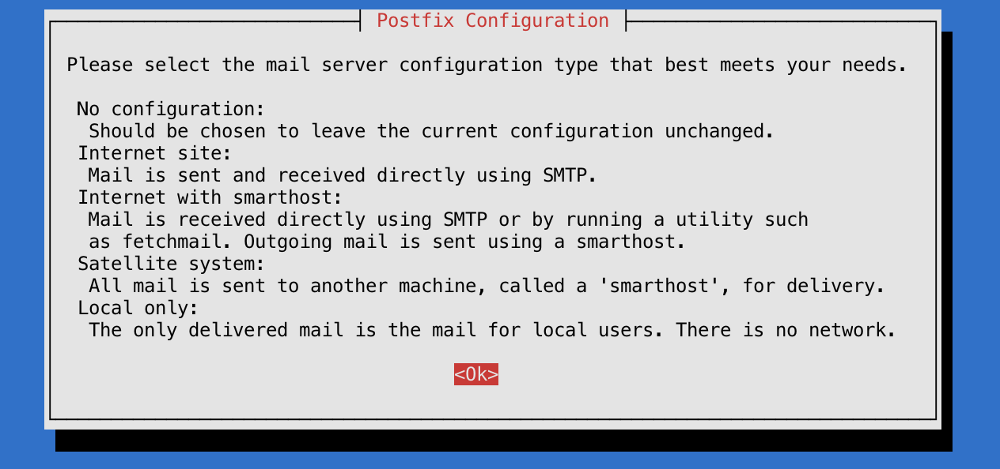
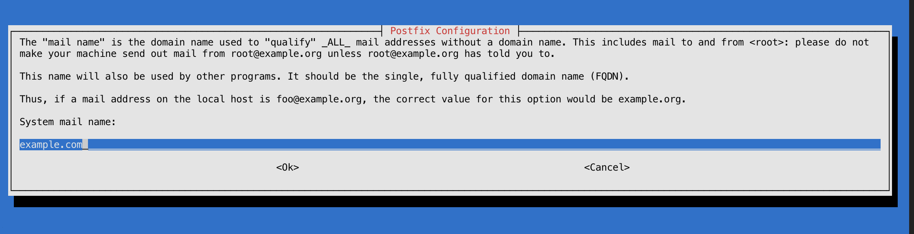

# Як встановити та налаштувати Postfix

## Debian 11

Postfix — це поштовий агент (MTA), програма, яка використовується для надсилання та отримання електронної пошти. 
У цьому tutorial ми встановимо та налаштуємо Postfix, щоб його можна було використовувати для надсилання 
електронних листів лише локальними програмами, тобто тими, які встановлені на тому самому сервері, що й Postfix.

Для чого це потрібно?

Якщо ви вже використовуєте стороннього постачальника електронної пошти для надсилання та отримання електронних листів, 
вам не потрібно запускати власний поштовий сервер. Однак, якщо ви керуєте власним сервером, 
на якому встановлено програми, які потребують надсилання сповіщень електронною поштою, 
запуск локального SMTP-сервера лише для надсилання є хорошою альтернативою використанню стороннього 
постачальника послуг електронної пошти або запуску повномасштабного SMTP серверу.

### Отже, поїхали!

`Передумови`

1. [x] Користувач із правами **sudo**.
2. [x] Дійсне доменне ім’я, наприклад **example.com**, що вказує на ваш сервер.

### Встановлення

```shell
sudo apt update
sudo apt install mailutils
sudo apt install postfix

# Далі появиться вікно де потрібно підтвердити встановлення і вибрати наступний пункт **Internet site**,
# після чого в наступному вікні вести доменне ім’я, котре вказує на даний сервер.
```




Потрібно внести певні налаштування для Postfix.
```shell
sudo nano /etc/postfix/main.cf
```

```shell {12,24} title="/etc/postfix/main.cf"
# знайти
. . .
mailbox_size_limit = 0
recipient_delimiter = +
inet_interfaces = all
. . .

# замінити inet_interfaces = all на inet_interfaces = loopback-only
  . . .
mailbox_size_limit = 0
recipient_delimiter = +
inet_interfaces = loopback-only
. . .

# знайти

. . .
mydestination = $myhostname, example.com, localhost.com, , localhost
. . .

# замінити mydestination

. . .
mydestination = $myhostname, localhost.$mydomain, $mydomain
. . .
```

Після збереження налаштувань, перезавантажити сервіс:
```shell
sudo systemctl restart postfix
```

Перевіряємо відсилання пошти з командної стрічки, замінивши your_email_address на Вашу поштову скриньку:

```shell
echo "This is the body of the email" | mail -s "This is the subject line" your_email_address
```

Останній крок, це перенаправлення системної пошти:

```shell
sudo nano /etc/aliases
```

```shell {14} title="/etc/aliases"
mailer-daemon: postmaster
postmaster: root
nobody: root
hostmaster: root
usenet: root
news: root
webmaster: root
www: root
ftp: root
abuse: root
noc: root
security: root
# Добавити в кінець стрічку з Вашою діючою поштовою скринькою.
root:          your_email_address
```
Щоб зміни примінились, потрібно:

```shell
sudo newaliases
```

Перевіряємо відсилання системної пошти з командної стрічки, замінивши your_email_address на Вашу поштову скриньку:

```shell
echo "This is the body of the email" | mail -s "This is the subject line" root
```

