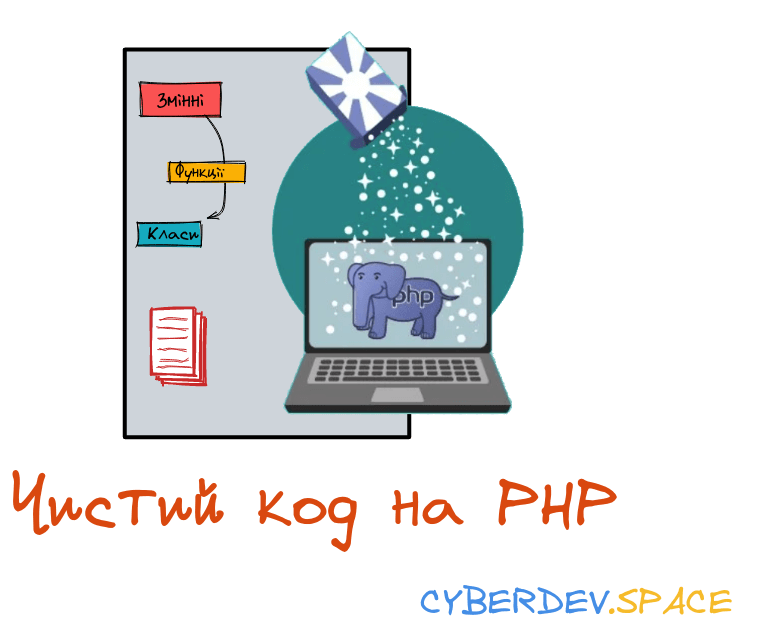

# Чистий код на PHP



## Переклад

* 🇺🇦 **Ukrainian:**
   * [PetroOstapuk/clean-code-php](https://github.com/PetroOstapuk/clean-code-php)

## Вступ

Принципи розробки програмного забезпечення з книги Роберта К. Мартіна 
[*Clean Code*](https://www.amazon.com/Clean-Code-Handbook-Software-Craftsmanship/dp/0132350882)
адаптований для PHP. Це не керівництво по стилю. Це посібник по створенню читабельного, повторно використовуваного та 
придатного до рефакторингу програмного забезпечення на PHP.

Не обов'язково дотримуватися кожного принципу, викладеного тут, і ще менше з них будуть прийняті всіма. Це лише 
рекомендації, але вони були сформовані протягом багатьох років колективного досвіду авторами "Чистого коду".

На основі [clean-code-javascript](https://github.com/ryanmcdermott/clean-code-javascript)

Більшість прикладів у цій статті працюють з PHP 7+.

## Змінні

### Використовуйте значущі й вимовні імена змінних

**Погано:**

```php
$ymdstr = $moment->format('y-m-d');
```

**Добре:**

```php
$currentDate = $moment->format('y-m-d');
```

**[⬆ повернутись до змісту](#зміст)**

### Для одного типу змінних використовуйте єдиний словник

**Погано:**

```php
getUserInfo();
getUserData();
getUserRecord();
getUserProfile();
```

**Добре:**

```php
getUser();
```

**[⬆ повернутись до змісту](#зміст)**

### Використовуйте імена, за якими зручно шукати (частина 1)

Ми читаємо більше коду, ніж пишемо. Важливо, щоб код, який ми пишемо, був читабельним та здатним 
до пошуку. Надавайте своїм іменам зрозумілі назви, які можна легко знайти.

**Погано:**

```php
// What the heck is 448 for?
$result = $serializer->serialize($data, 448);
```

**Добре:**

```php
$json = $serializer->serialize($data, JSON_UNESCAPED_SLASHES | JSON_PRETTY_PRINT | JSON_UNESCAPED_UNICODE);
```

### Використовуйте імена, за якими зручно шукати (частина 2)

**Погано:**

```php
class User
{
    // What the heck is 7 for?
    public $access = 7;
}

// What the heck is 4 for?
if ($user->access & 4) {
    // ...
}

// What's going on here?
$user->access ^= 2;
```

**Добре:**

```php
class User
{
    public const ACCESS_READ = 1;
    public const ACCESS_CREATE = 2;
    public const ACCESS_UPDATE = 4;
    public const ACCESS_DELETE = 8;

    // User as default can read, create and update something
    public $access = self::ACCESS_READ | self::ACCESS_CREATE | self::ACCESS_UPDATE;
}

if ($user->access & User::ACCESS_UPDATE) {
    // do edit ...
}

// Deny access rights to create something
$user->access ^= User::ACCESS_CREATE;
```

**[⬆ повернутись до змісту](#зміст)**

### Використовуйте пояснювальні змінні

**Погано:**

```php
$address = 'One Infinite Loop, Cupertino 95014';
$cityZipCodeRegex = '/^[^,]+,\s*(.+?)\s*(\d{5})$/';
preg_match($cityZipCodeRegex, $address, $matches);

saveCityZipCode($matches[1], $matches[2]);
```

**Не погано:**

Це краще, але ми все ще сильно залежні від regex.

```php
$address = 'One Infinite Loop, Cupertino 95014';
$cityZipCodeRegex = '/^[^,]+,\s*(.+?)\s*(\d{5})$/';
preg_match($cityZipCodeRegex, $address, $matches);

[, $city, $zipCode] = $matches;
saveCityZipCode($city, $zipCode);
```

**Добре:**

Зменшуйте залежність від регулярних виразів, надаючи імена підшаблонам.

```php
$address = 'One Infinite Loop, Cupertino 95014';
$cityZipCodeRegex = '/^[^,]+,\s*(?<city>.+?)\s*(?<zipCode>\d{5})$/';
preg_match($cityZipCodeRegex, $address, $matches);

saveCityZipCode($matches['city'], $matches['zipCode']);
```

**[⬆ повернутись до змісту](#зміст)**

### Уникайте глибоких вкладень (частина 1)

Занадто багато умовних операторів if-else можуть зробити ваш код важким для розуміння. Явне краще, ніж неявне.

**Погано:**

```php
function isShopOpen($day): bool
{
    if ($day) {
        if (is_string($day)) {
            $day = strtolower($day);
            if ($day === 'friday') {
                return true;
            } elseif ($day === 'saturday') {
                return true;
            } elseif ($day === 'sunday') {
                return true;
            } else {
                return false;
            }
        } else {
            return false;
        }
    } else {
        return false;
    }
}
```

**Добре:**

```php
function isShopOpen(string $day): bool
{
    if (empty($day)) {
        return false;
    }

    $openingDays = ['friday', 'saturday', 'sunday'];

    return in_array(strtolower($day), $openingDays, true);
}
```

**[⬆ повернутись до змісту](#зміст)**

### Уникайте глибоких вкладень (частина 2)

**Погано:**

```php
function fibonacci(int $n)
{
    if ($n < 50) {
        if ($n !== 0) {
            if ($n !== 1) {
                return fibonacci($n - 1) + fibonacci($n - 2);
            } else {
                return 1;
            }
        } else {
            return 0;
        }
    } else {
        return 'Not supported';
    }
}
```

**Добре:**

```php
function fibonacci(int $n): int
{
    if ($n === 0 || $n === 1) {
        return $n;
    }

    if ($n >= 50) {
        throw new \Exception('Not supported');
    }

    return fibonacci($n - 1) + fibonacci($n - 2);
}
```

**[⬆ повернутись до змісту](#зміст)**

### Уникайте ментального зіставлення

Не змушуйте читача вашого коду перекладати значення змінної. Явне краще, ніж неявне.

**Погано:**

```php
$l = ['Austin', 'New York', 'San Francisco'];

for ($i = 0; $i < count($l); $i++) {
    $li = $l[$i];
    doStuff();
    doSomeOtherStuff();
    // ...
    // ...
    // ...
    // Wait, what is `$li` for again?
    dispatch($li);
}
```

**Добре:**

```php
$locations = ['Austin', 'New York', 'San Francisco'];

foreach ($locations as $location) {
    doStuff();
    doSomeOtherStuff();
    // ...
    // ...
    // ...
    dispatch($location);
}
```

**[⬆ повернутись до змісту](#зміст)**

### Не додавайте непотрібний контекст

Якщо ім'я вашого класу/об'єкта є змістовним і зрозумілим, не повторюйте це в імені змінної.

**Погано:**

```php
class Car
{
    public $carMake;
    public $carModel;
    public $carColor;

    //...
}
```

**Добре:**

```php
class Car
{
    public $make;
    public $model;
    public $color;

    //...
}
```

**[⬆ повернутись до змісту](#зміст)**

### Використовуйте аргументи за замовчуванням замість коротких або умовних

**Погано:**

Це погано тому, що `$breweryName` може бути `NULL`.

```php
function createMicrobrewery($breweryName = 'Hipster Brew Co.'): void
{
    // ...
}
```

**Не погано:**

Ця думка більш зрозуміла, ніж попередня версія, бо краще контролює значення змінної.

```php
function createMicrobrewery($name = null): void
{
    $breweryName = $name ?: 'Hipster Brew Co.';
    // ...
}
```

**Добре:**

Ви можете використовувати [type hinting](http://php.net/manual/en/functions.arguments.php#functions.arguments.type-declaration) 
і бути упевненим, що `$breweryName` не буде `NULL`.

```php
function createMicrobrewery(string $breweryName = 'Hipster Brew Co.'): void
{
    // ...
}
```

**[⬆ повернутись до змісту](#зміст)**

## Порівняння

### Використовуйте [ідентичне порівняння](http://php.net/manual/en/language.operators.comparison.php)

**Погано:**

Просте порівняння перетворить рядок на ціле число.

```php
$a = '42';
$b = 42;

if ($a != $b) {
   // The expression will always pass
}
```

Порівняння `$a != $b` повертає `FALSE`, але насправді це `TRUE`! Рядок `"42"` відрізняється від цілого числа `42`.

**Добре:**

Ідентичне порівняння порівнює тип і значення.

```php
$a = '42';
$b = 42;

if ($a !== $b) {
    // The expression is verified
}
```

Порівняння `$a !== $b` поверне `TRUE`.

До PHP 8.0.0, якщо рядок (string) порівнювався з числом або рядком, що містить число, то рядок (string) перетворювалося 
на число перед виконанням порівняння. Це могло призвести до несподіваних результатів, які можна побачити на наступному 
прикладі.

```php

<?php
var_dump(0 == "a");
var_dump("1" == "01");
var_dump("10" == "1e1");
var_dump(100 == "1e2");

switch ("a") {
case 0:
    echo "0";
    break;
case "a":
    echo "a";
    break;
}
?>
```

Результати порівняння:
```php
//PHP 7
bool(true)
bool(true)
bool(true)
bool(true)
0

//PHP 8
bool(false)
bool(true)
bool(true)
bool(true)
a
```

**[⬆ повернутись до змісту](#зміст)**

### Оператор об'єднання з перевіркою на NULL.

Null об'єднання є новим оператором [введено в PHP 7](https://www.php.net/manual/en/migration70.new-features.php).
Оператор злиття з перевіркою на `NULL ??` був доданий як синтаксичний цукор для звичайного випадку, коли потрібно 
використовувати тернарний оператор разом з `isset()`. Він повертає свій перший операнд, якщо він існує і не є `null`; 
в іншому випадку він повертає свій другий операнд.

**Погано:**

```php
if (isset($_GET['name'])) {
    $name = $_GET['name'];
} elseif (isset($_POST['name'])) {
    $name = $_POST['name'];
} else {
    $name = 'nobody';
}
```

**Добре:**
```php
$name = $_GET['name'] ?? $_POST['name'] ?? 'nobody';
```

**[⬆ повернутись до змісту](#зміст)**

## Функції

### Аргументи функції (ідеально 2 або менше)

Обмеження кількості параметрів функції є неймовірно важливим, оскільки це полегшує тестування вашої функції. 
Наявність понад трьох параметрів призводить до комбінаторного вибуху коли вам доведеться тестувати безліч різних 
випадків з кожним окремим аргументом.

Нуль аргументів - ідеальний випадок. Один або два аргументи - нормально, а трьох краще уникати. Все, що більше, має бути 
консолідованим. Зазвичай, якщо у вас понад двох аргументів, то ваша функція намагається зробити занадто багато. 
У випадках, коли це не так, здебільшого випадків, як аргумент достатньо об'єкта вищого рівня.

**Погано:**

```php
class Questionnaire
{
    public function __construct(
        string $firstname,
        string $lastname,
        string $patronymic,
        string $region,
        string $district,
        string $city,
        string $phone,
        string $email
    ) {
        // ...
    }
}
```

**Добре:**

```php
class Name
{
    private $firstname;
    private $lastname;
    private $patronymic;

    public function __construct(string $firstname, string $lastname, string $patronymic)
    {
        $this->firstname = $firstname;
        $this->lastname = $lastname;
        $this->patronymic = $patronymic;
    }

    // getters ...
}

class City
{
    private $region;
    private $district;
    private $city;

    public function __construct(string $region, string $district, string $city)
    {
        $this->region = $region;
        $this->district = $district;
        $this->city = $city;
    }

    // getters ...
}

class Contact
{
    private $phone;
    private $email;

    public function __construct(string $phone, string $email)
    {
        $this->phone = $phone;
        $this->email = $email;
    }

    // getters ...
}

class Questionnaire
{
    public function __construct(Name $name, City $city, Contact $contact)
    {
        // ...
    }
}
```

**[⬆ повернутись до змісту](#зміст)**

### Назви функцій мають вказувати на їх призначення

**Погано:**

```php
class Email
{
    //...

    public function handle(): void
    {
        mail($this->to, $this->subject, $this->body);
    }
}

$message = new Email(...);
// What is this? A handle for the message? Are we writing to a file now?
$message->handle();
```

**Добре:**

```php
class Email
{
    //...

    public function send(): void
    {
        mail($this->to, $this->subject, $this->body);
    }
}

$message = new Email(...);
// Clear and obvious
$message->send();
```

**[⬆ повернутись до змісту](#зміст)**

### Функції повинні мати лише один рівень абстракції

Коли у вас є більше одного рівня абстракції, ваша функція зазвичай робить забагато. Розбиття функцій призводить до 
повторного використання та полегшує тестування.

**Погано:**

```php
function parseBetterPHPAlternative(string $code): void
{
    $regexes = [
        // ...
    ];

    $statements = explode(' ', $code);
    $tokens = [];
    foreach ($regexes as $regex) {
        foreach ($statements as $statement) {
            // ...
        }
    }

    $ast = [];
    foreach ($tokens as $token) {
        // lex...
    }

    foreach ($ast as $node) {
        // parse...
    }
}
```

**Погано too:**

Ми виконали деяку функціональність, але функція `parseBetterPHPAlternative()` все ще дуже складна і не піддається тестуванню.
```php
function tokenize(string $code): array
{
    $regexes = [
        // ...
    ];

    $statements = explode(' ', $code);
    $tokens = [];
    foreach ($regexes as $regex) {
        foreach ($statements as $statement) {
            $tokens[] = /* ... */;
        }
    }

    return $tokens;
}

function lexer(array $tokens): array
{
    $ast = [];
    foreach ($tokens as $token) {
        $ast[] = /* ... */;
    }

    return $ast;
}

function parseBetterPHPAlternative(string $code): void
{
    $tokens = tokenize($code);
    $ast = lexer($tokens);
    foreach ($ast as $node) {
        // parse...
    }
}
```

**Добре:**

Найкращим рішенням є вилучення залежностей від функції `parseBetterPHPAlternative()`.

```php
class Tokenizer
{
    public function tokenize(string $code): array
    {
        $regexes = [
            // ...
        ];

        $statements = explode(' ', $code);
        $tokens = [];
        foreach ($regexes as $regex) {
            foreach ($statements as $statement) {
                $tokens[] = /* ... */;
            }
        }

        return $tokens;
    }
}

class Lexer
{
    public function lexify(array $tokens): array
    {
        $ast = [];
        foreach ($tokens as $token) {
            $ast[] = /* ... */;
        }

        return $ast;
    }
}

class BetterPHPAlternative
{
    private $tokenizer;
    private $lexer;

    public function __construct(Tokenizer $tokenizer, Lexer $lexer)
    {
        $this->tokenizer = $tokenizer;
        $this->lexer = $lexer;
    }

    public function parse(string $code): void
    {
        $tokens = $this->tokenizer->tokenize($code);
        $ast = $this->lexer->lexify($tokens);
        foreach ($ast as $node) {
            // parse...
        }
    }
}
```

**[⬆ повернутись до змісту](#зміст)**

### Не використовуйте прапорці як параметри функцій

Булеві параметри говорять користувачеві, що функція робить більше, ніж одну річ. Функції повинні робити одну річ. 
Розбийте вашу функцію на кілька, якщо вони йдуть різними шляхами коду, залежно від булевого значення.

**Погано:**

```php
function createFile(string $name, bool $temp = false): void
{
    if ($temp) {
        touch('./temp/'.$name);
    } else {
        touch($name);
    }
}
```

**Добре:**

```php
function createFile(string $name): void
{
    touch($name);
}

function createTempFile(string $name): void
{
    touch('./temp/'.$name);
}
```

**[⬆ повернутись до змісту](#зміст)**

### Уникайте побічних ефектів

Функція викликає побічний ефект, якщо вона робить щось, крім приймання значення та повернення іншого значення або значень.
Побічні ефекти можуть включати запис до файлу, зміну глобальної змінної або випадкове перерахування всіх ваших грошей 
незнайомцю.

Звичайно, у програмі потрібно мати побічні ефекти. Наприклад, як у попередньому прикладі, вам може знадобитися запис до 
файлу. Важливо централізувати те, що ви робите. Не створюйте декілька функцій і класів, що записують до певного файлу. 
Має бути лише один сервіс, що це робить.

Основна ідея полягає у тому, щоб уникати поширених помилок, таких як спільний стан між об'єктами без будь-якої структури, 
використання змінних типів даних, які можуть бути змінені будь-чим та невідцентроване розміщення побічних ефектів. 
Якщо ви можете досягти цього, ви будете щасливішими за більшість інших програмістів.

**Погано:**

```php
// Global variable referenced by following function.
// If we had another function that used this name, now it'd be an array and it could break it.
$name = 'Ryan McDermott';

function splitIntoFirstAndLastName(): void
{
    global $name;

    $name = explode(' ', $name);
}

splitIntoFirstAndLastName();

var_dump($name); // ['Ryan', 'McDermott'];
```

**Добре:**

```php
function splitIntoFirstAndLastName(string $name): array
{
    return explode(' ', $name);
}

$name = 'Ryan McDermott';
$newName = splitIntoFirstAndLastName($name);

var_dump($name); // 'Ryan McDermott';
var_dump($newName); // ['Ryan', 'McDermott'];
```

**[⬆ повернутись до змісту](#зміст)**

### Не записуйте до глобальних функцій

Забруднення глобальних змінних є поганою практикою у багатьох мовах програмування, оскільки ви можете зіткнутися з іншою 
бібліотекою, і користувач вашого API не буде попереджений, поки не отримає виняток у продакшені. 
Подумаймо про приклад: що, якщо вам потрібен масив конфігурації? Ви можете написати глобальну функцію, наприклад, 
`config()`, але це може зіткнутися з іншою бібліотекою, яка також намагатиметься зробити те саме.


**Погано:**

```php
function config(): array
{
    return  [
        'foo' => 'bar',
    ];
}
```

**Добре:**

```php
class Configuration
{
    private $configuration = [];

    public function __construct(array $configuration)
    {
        $this->configuration = $configuration;
    }

    public function get(string $key): ?string
    {
        // null coalescing operator 
        return $this->configuration[$key] ?? null;
    }
}
```

Завантажте конфігурацію та створіть екземпляр класу `Configuration`.

```php
$configuration = new Configuration([
    'foo' => 'bar',
]);
```

І тепер вам потрібно використовувати екземпляр класу `Configuration` у своєму додатку.

**[⬆ повернутись до змісту](#зміст)**

### Не використовуйте патерн Одинак

Сінґлтон є [анти-патерном](https://en.wikipedia.org/wiki/Singleton_pattern). За перефразованими словами Брайана Баттона:

1. Зазвичай він використовуються як **глобальний екземпляр**. Чому це Погано? Тому що **ви приховуєте залежності** вашої програми 
в вашому коді, замість того, щоб викладати їх через інтерфейси. Робити щось глобальним, щоб уникнути передачі даних по 
всій програмі, є запахом коду.
2. Він порушує [принцип єдиного обов'язку](#принцип-єдиного-обовязку--srp-), оскільки керують своїм власним створенням та життєвим циклом.
3. Він неодмінно призводить до [зв'язності](https://uk.wikipedia.org/wiki/Зв'язність_(програмування)). Це ускладнює їх 
емуляцію під час тестування, в багатьох випадках.
4. Він зберігає стан упродовж життєвого циклу програми. Це також впливає на тестування, оскільки може статися так, 
що тести потребують послідовного запуску, що не допустимо для юніт-тестів. Чому? Тому що кожен юніт-тест має бути 
незалежним від інших.

Також [Misko Hevery](http://misko.hevery.com/about/) висловлює думку про [корінь проблеми](http://misko.hevery.com/2008/08/25/root-cause-of-singletons/).

**Погано:**

```php
class DBConnection
{
    private static $instance;

    private function __construct(string $dsn)
    {
        // ...
    }

    public static function getInstance(): DBConnection
    {
        if (self::$instance === null) {
            self::$instance = new self();
        }

        return self::$instance;
    }

    // ...
}

$singleton = DBConnection::getInstance();
```

**Добре:**

```php
class DBConnection
{
    public function __construct(string $dsn)
    {
        // ...
    }

     // ...
}
```

Створіть екземпляр класу `DBConnection` та налаштуйте його з допомогою [DSN](http://php.net/manual/en/pdo.construct.php#refsect1-pdo.construct-parameters).

```php
$connection = new DBConnection($dsn);
```

Тепер вам потрібно використовувати екземпляр класу `DBConnection` у своєму додатку.

**[⬆ повернутись до змісту](#зміст)**

### Інкапсулюйте умовні конструкції

**Погано:**

```php
if ($article->state === 'published') {
    // ...
}
```

**Добре:**

```php
if ($article->isPublished()) {
    // ...
}
```

**[⬆ повернутись до змісту](#зміст)**

### Уникайте умовних конструкцій із запереченням

**Погано:**

```php
function isDOMNodeNotPresent(\DOMNode $node): bool
{
    // ...
}

if (!isDOMNodeNotPresent($node))
{
    // ...
}
```

**Добре:**

```php
function isDOMNodePresent(\DOMNode $node): bool
{
    // ...
}

if (isDOMNodePresent($node)) {
    // ...
}
```

**[⬆ повернутись до змісту](#зміст)**

### Уникайте умовних конструкцій

Це здається неможливим завданням. Почувши це вперше, більшість людей кажуть: "як я повинен щось зробити без оператора 
`if`?" Відповідь полягає в тому, що в багатьох випадках можна використовувати поліморфізм, щоб досягти тієї ж самої мети. 
Друге запитання зазвичай таке: "добре, це чудово, але навіщо мені це потрібно?" Відповідь полягає в попередньому концепті 
чистого коду, який ми вивчили: функція повинна робити тільки одну річ. Коли в класах та функціях є оператори `if`, ви 
повідомляєте своїм користувачам, що ваша функція робить більше однієї речі. Пам'ятайте, робіть тільки одну річ.

**Погано:**

```php
class Airplane
{
    // ...

    public function getCruisingAltitude(): int
    {
        switch ($this->type) {
            case '777':
                return $this->getMaxAltitude() - $this->getPassengerCount();
            case 'Air Force One':
                return $this->getMaxAltitude();
            case 'Cessna':
                return $this->getMaxAltitude() - $this->getFuelExpenditure();
        }
    }
}
```

**Добре:**

```php
interface Airplane
{
    // ...

    public function getCruisingAltitude(): int;
}

class Boeing777 implements Airplane
{
    // ...

    public function getCruisingAltitude(): int
    {
        return $this->getMaxAltitude() - $this->getPassengerCount();
    }
}

class AirForceOne implements Airplane
{
    // ...

    public function getCruisingAltitude(): int
    {
        return $this->getMaxAltitude();
    }
}

class Cessna implements Airplane
{
    // ...

    public function getCruisingAltitude(): int
    {
        return $this->getMaxAltitude() - $this->getFuelExpenditure();
    }
}
```

**[⬆ повернутись до змісту](#зміст)**

### Уникайте перевірки типів (частина 1)

PHP не строго типізована мова, що означає, що ваші функції можуть приймати будь-який тип аргументу. 
Іноді ця свобода може виявитись проблемою, і з'являється спокуса робити перевірку типів у ваших функціях. 
Але існує багато способів, які допоможуть уникнути цього. Перш за все потрібно забезпечити стійкий API.

**Погано:**

```php
function travelToTexas($vehicle): void
{
    if ($vehicle instanceof Bicycle) {
        $vehicle->pedalTo(new Location('texas'));
    } elseif ($vehicle instanceof Car) {
        $vehicle->driveTo(new Location('texas'));
    }
}
```

**Добре:**

```php
function travelToTexas(Vehicle $vehicle): void
{
    $vehicle->travelTo(new Location('texas'));
}
```

**[⬆ повернутись до змісту](#зміст)**

### Уникайте перевірки типів (частина 2)

Якщо ви працюєте з базовими примітивними типами даних, такими як рядки, цілі числа та масиви, і використовуєте 
PHP 7+ та не можете використовувати поліморфізм, але все ще відчуваєте потребу в перевірці типів, вам слід 
розглянути використання [оголошення типу](http://php.net/manual/en/functions.arguments.php#functions.arguments.type-declaration) 
або строгого режиму. Це надає вам статичну типізацію на основі стандартного 
синтаксису PHP. Проблема з ручною перевіркою типів полягає в тому, що це вимагає так багато додаткового коду, 
що псевдо "типобезпека", яку ви отримуєте, не виправдовує втраченої зрозумілості коду. Тримайте свій PHP код чистим, 
пишіть добрі тести та проводьте добре код-ревю. Інакше, робіть все це, але з використанням строгої типізації PHP 
або строгого режиму.


**Погано:**

```php
function combine($val1, $val2): int
{
    if (!is_numeric($val1) || !is_numeric($val2)) {
        throw new \Exception('Must be of type Number');
    }

    return $val1 + $val2;
}
```

**Добре:**

```php
function combine(int $val1, int $val2): int
{
    return $val1 + $val2;
}
```

**[⬆ повернутись до змісту](#зміст)**

### Вилучіть мертвий код

Мертвий код так само погано, як і дубльований код. Немає причин залишати його у своєму кодові. Якщо він 
не використовується, видаліть його! Він все ще буде збережений в історії версій, якщо вам все ще потрібно буде 
до нього звернутися.

**Погано:**

```php
function oldRequestModule(string $url): void
{
    // ...
}

function newRequestModule(string $url): void
{
    // ...
}

$request = newRequestModule($requestUrl);
inventoryTracker('apples', $request, 'www.inventory-awesome.io');
```

**Добре:**

```php
function requestModule(string $url): void
{
    // ...
}

$request = requestModule($requestUrl);
inventoryTracker('apples', $request, 'www.inventory-awesome.io');
```

**[⬆ повернутись до змісту](#зміст)**


## Об'єкти та структури даних

### Використовуйте інкапсуляцію об'єктів

У PHP ви можете використовувати ключові слова `public`, `protected` та `private` для методів. Використовуючи їх, 
ви можете контролювати зміну властивостей об'єкта.

* Коли вам потрібно більше, ніж лише отримання властивості об'єкта, вам не потрібно шукати й змінювати кожний метод 
доступу в вашій кодовій базі.
* Дозволяє легко додавати валідацію під час виклику `set`.
* Інкапсулює внутрішнє представлення об'єкта.
* Легко додати логування та обробку помилок під час отримання та встановлення властивостей.
* Наслідуючи цей клас, ви можете перевизначити функціональність за замовчуванням.
* Ви можете ліниво завантажувати властивості вашого об'єкта, наприклад, отримуючи їх з сервера.

Крім того, це частина принципу [Open/Closed](#принцип-відкритостізакритості--ocp-).

**Погано:**

```php
class BankAccount
{
    public $balance = 1000;
}

$bankAccount = new BankAccount();

// Buy shoes...
$bankAccount->balance -= 100;
```

**Добре:**

```php
class BankAccount
{
    private $balance;

    public function __construct(int $balance = 1000)
    {
      $this->balance = $balance;
    }

    public function withdraw(int $amount): void
    {
        if ($amount > $this->balance) {
            throw new \Exception('Amount greater than available balance.');
        }

        $this->balance -= $amount;
    }

    public function deposit(int $amount): void
    {
        $this->balance += $amount;
    }

    public function getBalance(): int
    {
        return $this->balance;
    }
}

$bankAccount = new BankAccount();

// Buy shoes...
$bankAccount->withdraw($shoesPrice);

// Get balance
$balance = $bankAccount->getBalance();
```

**[⬆ повернутись до змісту](#зміст)**

### Робіть поля об'єктів приватними або захищеними.

* `public` модифікатор для методів та властивостей є найбільш небезпечними для змін, оскільки зовнішній код може 
легко розраховувати на них і ви не можете контролювати, на що розраховує код. Модифікації в класі є небезпечними для 
всіх користувачів класу.
* `protected` модифікатор так само небезпечний, як і `public`, оскільки він доступний в області будь-якого 
дочірнього класу. Це практично означає, що різниця між `public` та `protected` полягає лише у механізмі доступу, 
але гарантія інкапсуляції залишається тією ж самою. Модифікації в класі є небезпечними для всіх нащадків класу.
* `private` модифікатор гарантує, що код є **небезпечним для змін лише в межах одного класу** (ви захищені від 
модифікацій ззовні й не матимете ефекту Jenga).

Отже, за замовчуванням використовуйте `private`, а `public/protected` - коли вам потрібно надати доступ зовнішнім класам.

Для отримання додаткової інформації ви можете прочитати [пост у блозі](http://fabien.potencier.org/pragmatism-over-theory-protected-vs-private.html) 
на цю тему, написаний [Fabien Potencier](https://github.com/fabpot).

**Погано:**

```php
class Employee
{
    public $name;

    public function __construct(string $name)
    {
        $this->name = $name;
    }
}

$employee = new Employee('John Doe');
echo 'Employee name: '.$employee->name; // Employee name: John Doe
```

**Добре:**

```php
class Employee
{
    private $name;

    public function __construct(string $name)
    {
        $this->name = $name;
    }

    public function getName(): string
    {
        return $this->name;
    }
}

$employee = new Employee('John Doe');
echo 'Employee name: '.$employee->getName(); // Employee name: John Doe
```

**[⬆ повернутись до змісту](#зміст)**

## Класи

### Перевага композиції над успадкуванням

Як зазначається у відомій книзі [*Design Patterns*](https://en.wikipedia.org/wiki/Design_Patterns) від "Банди Чотирьох", 
варто віддавати перевагу композиції перед успадкуванням, якщо це можливо. Є багато добрих причин для використання 
успадкування і багато добрих причин для використання композиції. Основна мета цього правила полягає в тому, 
що якщо ваш розум інстинктивно налаштований на успадкування, спробуйте подумати, чи може композиція краще описати вашу 
проблему. У деяких випадках вона може бути кращим рішенням.

Ви, можливо, ставите собі питання: "коли ж мені варто використовувати наслідування?" Це залежить від вашої конкретної 
проблеми, але ось список випадків, коли наслідування є більш доцільним, ніж композиція:

1. Ваше наслідування представляє "є" відношення, а не "має" відношення (Human->Animal проти User->UserDetails).
2. Ви можете використовувати код з базових класів (Людина може рухатись як будь-яка тварина).
3. Ви хочете внести глобальні зміни в похідні класи, змінивши базовий клас (зміна калорійної витрати всіх тварин під час руху).

**Погано:**

```php
class Employee
{
    private $name;
    private $email;

    public function __construct(string $name, string $email)
    {
        $this->name = $name;
        $this->email = $email;
    }

    // ...
}

// Bad because Employees "have" tax data.
// EmployeeTaxData is not a type of Employee

class EmployeeTaxData extends Employee
{
    private $ssn;
    private $salary;

    public function __construct(string $name, string $email, string $ssn, string $salary)
    {
        parent::__construct($name, $email);

        $this->ssn = $ssn;
        $this->salary = $salary;
    }

    // ...
}
```

**Добре:**

```php
class EmployeeTaxData
{
    private $ssn;
    private $salary;

    public function __construct(string $ssn, string $salary)
    {
        $this->ssn = $ssn;
        $this->salary = $salary;
    }

    // ...
}

class Employee
{
    private $name;
    private $email;
    private $taxData;

    public function __construct(string $name, string $email)
    {
        $this->name = $name;
        $this->email = $email;
    }

    public function setTaxData(EmployeeTaxData $taxData)
    {
        $this->taxData = $taxData;
    }

    // ...
}
```

**[⬆ повернутись до змісту](#зміст)**

### Уникайте ланцюжкових методів

[Fluent interface](http://localhost:3000/docs/tutorials/programming/patterns/structural-patterns/fluent_interface) це об'єктноорієнтований API, який має на меті 
покращити читабельність вихідного коду за допомогою використання
[Ланцюжкових методів](https://en.wikipedia.org/wiki/Method_chaining).

Хоча є деякі контексти, часто об'єкти-будівники, де цей шаблон зменшує об'єм коду (наприклад,  [PHPUnit Mock Builder](https://phpunit.de/manual/current/en/test-doubles.html)
чи [Doctrine Query Builder](http://docs.doctrine-project.org/projects/doctrine-dbal/en/latest/reference/query-builder.html)),
частіше це пов'язано з деякими витратами:

1. Порушує [Encapsulation](https://en.wikipedia.org/wiki/Encapsulation_%28object-oriented_programming%29).
2. Порушує [Decorators](https://en.wikipedia.org/wiki/Decorator_pattern).
3. Складніше [імітувати](https://en.wikipedia.org/wiki/Mock_object) в тестах.
4. Робить відмінності комітів важчими для читання.

Для отримання додаткової інформації ви можете прочитати повний текст [статті](https://ocramius.github.io/blog/fluent-interfaces-are-evil/)
на цю тему написав [Marco Pivetta](https://github.com/Ocramius).

**Погано:**

```php
class Car
{
    private $make = 'Honda';
    private $model = 'Accord';
    private $color = 'white';

    public function setMake(string $make): self
    {
        $this->make = $make;

        // NOTE: Returning this for chaining
        return $this;
    }

    public function setModel(string $model): self
    {
        $this->model = $model;

        // NOTE: Returning this for chaining
        return $this;
    }

    public function setColor(string $color): self
    {
        $this->color = $color;

        // NOTE: Returning this for chaining
        return $this;
    }

    public function dump(): void
    {
        var_dump($this->make, $this->model, $this->color);
    }
}

$car = (new Car())
  ->setColor('pink')
  ->setMake('Ford')
  ->setModel('F-150')
  ->dump();
```

**Добре:**

```php
class Car
{
    private $make = 'Honda';
    private $model = 'Accord';
    private $color = 'white';

    public function setMake(string $make): void
    {
        $this->make = $make;
    }

    public function setModel(string $model): void
    {
        $this->model = $model;
    }

    public function setColor(string $color): void
    {
        $this->color = $color;
    }

    public function dump(): void
    {
        var_dump($this->make, $this->model, $this->color);
    }
}

$car = new Car();
$car->setColor('pink');
$car->setMake('Ford');
$car->setModel('F-150');
$car->dump();
```

**[⬆ повернутись до змісту](#зміст)**

### Перевага оголошення фінальних (final) класів

За можливості слід використовувати `final`::

1. Воно запобігає неконтрольованому ланцюжку успадкування.
2. Воно сприяє композиції над успадкуванням. [composition](#prefer-composition-over-inheritance).
3. Воно підтримує принцип єдиного обов'язку (SRP) [Single Responsibility Pattern](#single-responsibility-principle-srp).
4. Воно спонукає розробників використовувати ваші публічні методи замість успадкування класу для отримання доступу до захищених методів.
5. Воно дозволяє вам змінювати свій код без будь-яких помилок у додатках, які використовують ваш клас.

Єдине обмеження полягає в тому, що ваш клас має реалізувати інтерфейс і не повинен мати інших публічних методів.

Для додаткової інформації можна прочитати [статтю](https://ocramius.github.io/blog/when-to-declare-classes-final/) автора [Marco Pivetta (Ocramius)](https://ocramius.github.io/).

**Погано:**

```php
final class Car
{
    private $color;

    public function __construct($color)
    {
        $this->color = $color;
    }

    /**
     * @return string The color of the vehicle
     */
    public function getColor()
    {
        return $this->color;
    }
}
```

**Добре:**

```php
interface Vehicle
{
    /**
     * @return string The color of the vehicle
     */
    public function getColor();
}

final class Car implements Vehicle
{
    private $color;

    public function __construct($color)
    {
        $this->color = $color;
    }

    /**
     * {@inheritdoc}
     */
    public function getColor()
    {
        return $this->color;
    }
}
```

**[⬆ повернутись до змісту](#зміст)**

## SOLID

**SOLID** це мнемонічний абревіатурний акронім, який був запропонований Майклом Фезерсом для перших п'яти принципів, 
названих Робертом Мартіном. Ці принципи становлять п'ять основних принципів об'єктноорієнтованого програмування 
та проєктування.

* [S: Принцип єдиного обов'язку (SRP)](#принцип-єдиного-обовязку--srp-)
* [O: Принцип відкритості/закритості (OCP)](#принцип-відкритостізакритості--ocp-)
* [L: Принцип підстановки Барбари Лісков (LSP)](#принцип-підстановки-барбари-лісков--lsp-)
* [I: Принцип розділення інтерфейсу (ISP)](#принцип-розділення-інтерфейсу--isp-)
* [D: Принцип інверсії залежності (DIP)](#принцип-інверсії-залежності--dip-)


### Принцип єдиного обов'язку (SRP)

Як зазначено в "Clean Code", "Ніколи не повинно бути більше однієї причини для зміни класу". Дуже привабливо наповнити 
клас багатьма функціональностями, як у випадку, коли ви можете взяти з собою тільки одну валізу на рейс. 
Проблема полягає в тому, що ваш клас не буде концептуально згуртованим, і у нього буде багато причин для зміни. 
Мінімізація кількості випадків, коли потрібно змінити клас, є важливою. Це важливо, оскільки якщо в одному класі занадто 
багато функціональності, і ви змінюєте частину коду, то може бути важко зрозуміти, як це вплине на інші залежні модулі 
в вашому коді.

**Погано:**

```php
class UserSettings
{
    private $user;

    public function __construct(User $user)
    {
        $this->user = $user;
    }

    public function changeSettings(array $settings): void
    {
        if ($this->verifyCredentials()) {
            // ...
        }
    }

    private function verifyCredentials(): bool
    {
        // ...
    }
}
```

**Добре:**

```php
class UserAuth
{
    private $user;

    public function __construct(User $user)
    {
        $this->user = $user;
    }

    public function verifyCredentials(): bool
    {
        // ...
    }
}

class UserSettings
{
    private $user;
    private $auth;

    public function __construct(User $user)
    {
        $this->user = $user;
        $this->auth = new UserAuth($user);
    }

    public function changeSettings(array $settings): void
    {
        if ($this->auth->verifyCredentials()) {
            // ...
        }
    }
}
```

**[⬆ повернутись до змісту](#зміст)**

### Принцип відкритості/закритості (OCP)

Як зазначено Бертраном Майєром, "програмні сутності (класи, модулі, функції тощо) мають бути відкриті для розширення, 
але закриті для змін". Але що це означає? Основна ідея цього принципу полягає в тому, що ви маєте дозволити користувачам
додавати нові функціональності без зміни наявного коду.

**Погано:**

```php
abstract class Adapter
{
    protected $name;

    public function getName(): string
    {
        return $this->name;
    }
}

class AjaxAdapter extends Adapter
{
    public function __construct()
    {
        parent::__construct();

        $this->name = 'ajaxAdapter';
    }
}

class NodeAdapter extends Adapter
{
    public function __construct()
    {
        parent::__construct();

        $this->name = 'nodeAdapter';
    }
}

class HttpRequester
{
    private $adapter;

    public function __construct(Adapter $adapter)
    {
        $this->adapter = $adapter;
    }

    public function fetch(string $url): Promise
    {
        $adapterName = $this->adapter->getName();

        if ($adapterName === 'ajaxAdapter') {
            return $this->makeAjaxCall($url);
        } elseif ($adapterName === 'httpNodeAdapter') {
            return $this->makeHttpCall($url);
        }
    }

    private function makeAjaxCall(string $url): Promise
    {
        // request and return promise
    }

    private function makeHttpCall(string $url): Promise
    {
        // request and return promise
    }
}
```

**Добре:**

```php
interface Adapter
{
    public function request(string $url): Promise;
}

class AjaxAdapter implements Adapter
{
    public function request(string $url): Promise
    {
        // request and return promise
    }
}

class NodeAdapter implements Adapter
{
    public function request(string $url): Promise
    {
        // request and return promise
    }
}

class HttpRequester
{
    private $adapter;

    public function __construct(Adapter $adapter)
    {
        $this->adapter = $adapter;
    }

    public function fetch(string $url): Promise
    {
        return $this->adapter->request($url);
    }
}
```

**[⬆ повернутись до змісту](#зміст)**

### Принцип підстановки Барбари Лісков (LSP)

Це насправді дуже простий концепт, названий досить жахливою термінологією. 
Формально це визначається як "Якщо S є підтипом T, то об'єкти типу T можуть бути 
замінені об'єктами типу S (тобто об'єкти типу S можуть заміщувати об'єкти типу T) 
без зміни будь-яких корисних властивостей програми (правильність, виконана задача і т.д.)." 
Це визначення ще жахливіше.

Найкращим поясненням для цього є, якщо у вас є батьківський клас та дочірній клас, 
то базовий клас і дочірній клас можуть використовуватися взаємозамінно без отримання 
неправильних результатів. Проте це все ще може бути заплутаним, тому розгляньмо класичний
приклад квадрата і прямокутника. Математично квадрат є прямокутником, але якщо ви моделюєте 
його за допомогою відносини "є-типом" за допомогою наслідування, то ви швидко потрапите в складне положення.

**Погано:**

```php
class Rectangle
{
    protected $width = 0;
    protected $height = 0;

    public function setWidth(int $width): void
    {
        $this->width = $width;
    }

    public function setHeight(int $height): void
    {
        $this->height = $height;
    }

    public function getArea(): int
    {
        return $this->width * $this->height;
    }
}

class Square extends Rectangle
{
    public function setWidth(int $width): void
    {
        $this->width = $this->height = $width;
    }

    public function setHeight(int $height): void
    {
        $this->width = $this->height = $height;
    }
}

function printArea(Rectangle $rectangle): void
{
    $rectangle->setWidth(4);
    $rectangle->setHeight(5);

    // Погано: Will return 25 for Square. Should be 20.
    echo sprintf('%s has area %d.', get_class($rectangle), $rectangle->getArea()).PHP_EOL;
}

$rectangles = [new Rectangle(), new Square()];

foreach ($rectangles as $rectangle) {
    printArea($rectangle);
}
```

**Добре:**

Найкращим рішенням є розділення чотирикутників та виділення більш загального субтипу для обох фігур.

Попри видиму схожість квадрата та прямокутника, вони різні. Квадрат має багато спільного з ромбом, а прямокутник - 
з паралелограмом, але вони не є підтипами один одного. Квадрат, прямокутник, ромб та паралелограм - це окремі фігури 
з власними властивостями, хоча вони й схожі.

```php
interface Shape
{
    public function getArea(): int;
}

class Rectangle implements Shape
{
    private $width = 0;
    private $height = 0;

    public function __construct(int $width, int $height)
    {
        $this->width = $width;
        $this->height = $height;
    }

    public function getArea(): int
    {
        return $this->width * $this->height;
    }
}

class Square implements Shape
{
    private $length = 0;

    public function __construct(int $length)
    {
        $this->length = $length;
    }

    public function getArea(): int
    {
        return $this->length ** 2;
    }
}

function printArea(Shape $shape): void
{
    echo sprintf('%s has area %d.', get_class($shape), $shape->getArea()).PHP_EOL;
}

$shapes = [new Rectangle(4, 5), new Square(5)];

foreach ($shapes as $shape) {
    printArea($shape);
}
```

**[⬆ повернутись до змісту](#зміст)**

### Принцип розділення інтерфейсу (ISP)

Принцип ISP стверджує, що "Клієнти не повинні залежати від інтерфейсів, які вони не використовують."

Добрим прикладом, який демонструє цей принцип, є класи, які вимагають великих об'єктів налаштувань. 
Не вимагати від клієнтів налаштовувати великі кількості параметрів корисно, оскільки більшість часу 
вони не потребують всіх цих налаштувань. Якщо зробити їх необов'язковими, то це допоможе запобігти 
виникненню "товстого інтерфейсу".

**Погано:**

```php
interface Employee
{
    public function work(): void;

    public function eat(): void;
}

class HumanEmployee implements Employee
{
    public function work(): void
    {
        // ....working
    }

    public function eat(): void
    {
        // ...... eating in lunch break
    }
}

class RobotEmployee implements Employee
{
    public function work(): void
    {
        //.... working much more
    }

    public function eat(): void
    {
        //.... robot can't eat, but it must implement this method
    }
}
```

**Добре:**

Не кожен працівник є співробітником, але кожен співробітник є працівником. 
Термін "працівник" є більш загальним і може містити різні типи праці, включаючи фізичну працю та роботу на 
самозайнятій основі. Водночас термін "співробітник" зазвичай використовується для опису тих, 
хто працює на певну компанію або організацію і зазвичай має певний договір про працю або угоду.

```php
interface Workable
{
    public function work(): void;
}

interface Feedable
{
    public function eat(): void;
}

interface Employee extends Feedable, Workable
{
}

class HumanEmployee implements Employee
{
    public function work(): void
    {
        // ....working
    }

    public function eat(): void
    {
        //.... eating in lunch break
    }
}

// robot can only work
class RobotEmployee implements Workable
{
    public function work(): void
    {
        // ....working
    }
}
```

**[⬆ повернутись до змісту](#зміст)**

### Принцип інверсії залежності (DIP)

Принцип заявляє про дві суттєві речі:

1. Модулі високого рівня не повинні залежати від модулів нижчого рівня. Обидва повинні залежати від абстракцій.
2. Абстракції не повинні залежати від деталей. Деталі повинні залежати від абстракцій.

Це може бути важко зрозуміти на початку, але якщо ви працювали з фреймворками PHP (наприклад, Symfony), 
ви бачили реалізацію цього принципу у вигляді Dependency Injection (DI). Хоча це не тотожні концепції, 
DIP запобігає високорівневим модулям знати деталі низькорівневих модулів та налаштовувати їх. Це можливо завдяки DI. 
Велика перевага полягає в тому, що це зменшує зв'язок між модулями. Зв'язність є дуже поганою практикою розробки, 
оскільки це ускладнює рефакторинг вашого коду.


**Погано:**

```php
class Employee
{
    public function work(): void
    {
        // ....working
    }
}

class Robot extends Employee
{
    public function work(): void
    {
        //.... working much more
    }
}

class Manager
{
    private $employee;

    public function __construct(Employee $employee)
    {
        $this->employee = $employee;
    }

    public function manage(): void
    {
        $this->employee->work();
    }
}
```

**Добре:**

```php
interface Employee
{
    public function work(): void;
}

class Human implements Employee
{
    public function work(): void
    {
        // ....working
    }
}

class Robot implements Employee
{
    public function work(): void
    {
        //.... working much more
    }
}

class Manager
{
    private $employee;

    public function __construct(Employee $employee)
    {
        $this->employee = $employee;
    }

    public function manage(): void
    {
        $this->employee->work();
    }
}
```

**[⬆ повернутись до змісту](#зміст)**

## Не повторюйте себе (DRY)

Намагайтеся дотримуватися принципу [DRY](https://en.wikipedia.org/wiki/Don%27t_repeat_yourself) (не повторюйся).

Робіть все можливе, щоб уникнути дублювання коду. Дублювання коду - це погано, оскільки це означає, 
що потрібно змінювати логіку в більш ніж одному місці.

Уявіть, що ви ведете ресторан і відстежуєте свій інвентар: всі ваші помідори, цибуля, часник, спеції тощо.
Якщо у вас є кілька списків для цього, то всі вони повинні бути оновлені, коли ви подаєте страву з помідорами. 
Якщо ж у вас є лише один список, то потрібно оновлювати тільки одне місце!

Часто дублювання коду виникає тому, що у вас є два або більше незначно різних елементів, 
які мають багато спільного, але їхні відмінності змушують вас мати дві або більше окремих функцій, 
які виконують багато однакових дій. Видалення дубльованого коду означає створення абстракції, 
яка може обробляти цей набір різних елементів за допомогою однієї функції/модуля/класу.

Важливо правильно визначити абстракцію, тому вам слід дотримуватися принципів SOLID, 
наведених у розділі [Класи](#класи). Погані абстракції можуть бути гіршими за дубльований код, тому будьте обережні! 
Проте, якщо ви можете створити хорошу абстракцію, то зробіть це! Не повторюйте себе, 
інакше вам доведеться оновлювати кілька місць кожного разу, коли ви хочете змінити щось одне.

**Погано:**

```php
function showDeveloperList(array $developers): void
{
    foreach ($developers as $developer) {
        $expectedSalary = $developer->calculateExpectedSalary();
        $experience = $developer->getExperience();
        $githubLink = $developer->getGithubLink();
        $data = [
            $expectedSalary,
            $experience,
            $githubLink
        ];

        render($data);
    }
}

function showManagerList(array $managers): void
{
    foreach ($managers as $manager) {
        $expectedSalary = $manager->calculateExpectedSalary();
        $experience = $manager->getExperience();
        $githubLink = $manager->getGithubLink();
        $data = [
            $expectedSalary,
            $experience,
            $githubLink
        ];

        render($data);
    }
}
```

**Добре:**

```php
function showList(array $employees): void
{
    foreach ($employees as $employee) {
        $expectedSalary = $employee->calculateExpectedSalary();
        $experience = $employee->getExperience();
        $githubLink = $employee->getGithubLink();
        $data = [
            $expectedSalary,
            $experience,
            $githubLink
        ];

        render($data);
    }
}
```

**Very Добре:**

Краще використовувати компактну версію коду.

```php
function showList(array $employees): void
{
    foreach ($employees as $employee) {
        render([
            $employee->calculateExpectedSalary(),
            $employee->getExperience(),
            $employee->getGithubLink()
        ]);
    }
}
```

**[⬆ повернутись до змісту](#зміст)**