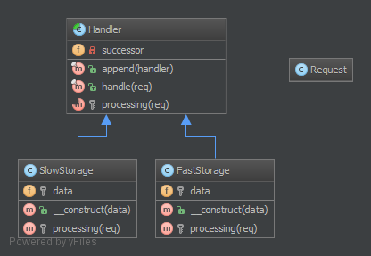

# 1. Ланцюжок відповідальностей (Chain Of Responsibilities)

## Призначення

Побудувати ланцюжок об'єктів для обробки виклику в послідовному порядку. Якщо один об’єкт не може впоратися із викликом, 
він делегує виклик наступному у ланцюжку тощо.

## Приклади

Фреймворк для логування, де кожен елемент ланцюга самостійно вирішує, що робити з повідомленням для логування.

Фільтр спаму.

Кешування: перший об’єкт є екземпляром, наприклад, інтерфейсу Memcached. Якщо запис у кеші відсутній, 
виклик делегується інтерфейсу бази даних.


## Діаграма UML



## Код
Ви можете знайти цей код на [GitHub](https://github.com/PetroOstapuk/DesignPatternsPHP/tree/main/Behavioral/ChainOfResponsibilities)

```php title="Handler.php"
<?php

declare(strict_types=1);

namespace DesignPatterns\Behavioral\ChainOfResponsibilities;

use Psr\Http\Message\RequestInterface;

abstract class Handler
{
    public function __construct(private ?Handler $successor = null)
    {
    }

    /**
     * This approach by using a template method pattern ensures you that
     * each subclass will not forget to call the successor
     */
    final public function handle(RequestInterface $request): ?string
    {
        $processed = $this->processing($request);

        if ($processed === null && $this->successor !== null) {
            // the request has not been processed by this handler => see the next
            $processed = $this->successor->handle($request);
        }

        return $processed;
    }

    abstract protected function processing(RequestInterface $request): ?string;
}
```

```php title="Responsible/HttpInMemoryCacheHandler.php"
<?php

declare(strict_types=1);

namespace DesignPatterns\Behavioral\ChainOfResponsibilities\Responsible;

use DesignPatterns\Behavioral\ChainOfResponsibilities\Handler;
use Psr\Http\Message\RequestInterface;

class HttpInMemoryCacheHandler extends Handler
{
    public function __construct(private array $data, ?Handler $successor = null)
    {
        parent::__construct($successor);
    }

    protected function processing(RequestInterface $request): ?string
    {
        $key = sprintf(
            '%s?%s',
            $request->getUri()->getPath(),
            $request->getUri()->getQuery()
        );

        if ($request->getMethod() == 'GET' && isset($this->data[$key])) {
            return $this->data[$key];
        }

        return null;
    }
}
```

```php title="Responsible/SlowDatabaseHandler.php"
<?php

declare(strict_types=1);

namespace DesignPatterns\Behavioral\ChainOfResponsibilities\Responsible;

use DesignPatterns\Behavioral\ChainOfResponsibilities\Handler;
use Psr\Http\Message\RequestInterface;

class SlowDatabaseHandler extends Handler
{
    protected function processing(RequestInterface $request): ?string
    {
        // this is a mockup, in production code you would ask a slow (compared to in-memory) DB for the results

        return 'Hello World!';
    }
}
```

## Тест

```php title="Tests/ChainTest.php"
<?php

declare(strict_types=1);

namespace DesignPatterns\Behavioral\ChainOfResponsibilities\Tests;

use DesignPatterns\Behavioral\ChainOfResponsibilities\Handler;
use DesignPatterns\Behavioral\ChainOfResponsibilities\Responsible\HttpInMemoryCacheHandler;
use DesignPatterns\Behavioral\ChainOfResponsibilities\Responsible\SlowDatabaseHandler;
use PHPUnit\Framework\TestCase;
use Psr\Http\Message\RequestInterface;
use Psr\Http\Message\UriInterface;

class ChainTest extends TestCase
{
    private Handler $chain;

    protected function setUp(): void
    {
        $this->chain = new HttpInMemoryCacheHandler(
            ['/foo/bar?index=1' => 'Hello In Memory!'],
            new SlowDatabaseHandler()
        );
    }

    public function testCanRequestKeyInFastStorage()
    {
        $uri = $this->createMock(UriInterface::class);
        $uri->method('getPath')->willReturn('/foo/bar');
        $uri->method('getQuery')->willReturn('index=1');

        $request = $this->createMock(RequestInterface::class);
        $request->method('getMethod')
            ->willReturn('GET');
        $request->method('getUri')->willReturn($uri);

        $this->assertSame('Hello In Memory!', $this->chain->handle($request));
    }

    public function testCanRequestKeyInSlowStorage()
    {
        $uri = $this->createMock(UriInterface::class);
        $uri->method('getPath')->willReturn('/foo/baz');
        $uri->method('getQuery')->willReturn('');

        $request = $this->createMock(RequestInterface::class);
        $request->method('getMethod')
            ->willReturn('GET');
        $request->method('getUri')->willReturn($uri);

        $this->assertSame('Hello World!', $this->chain->handle($request));
    }
}
```