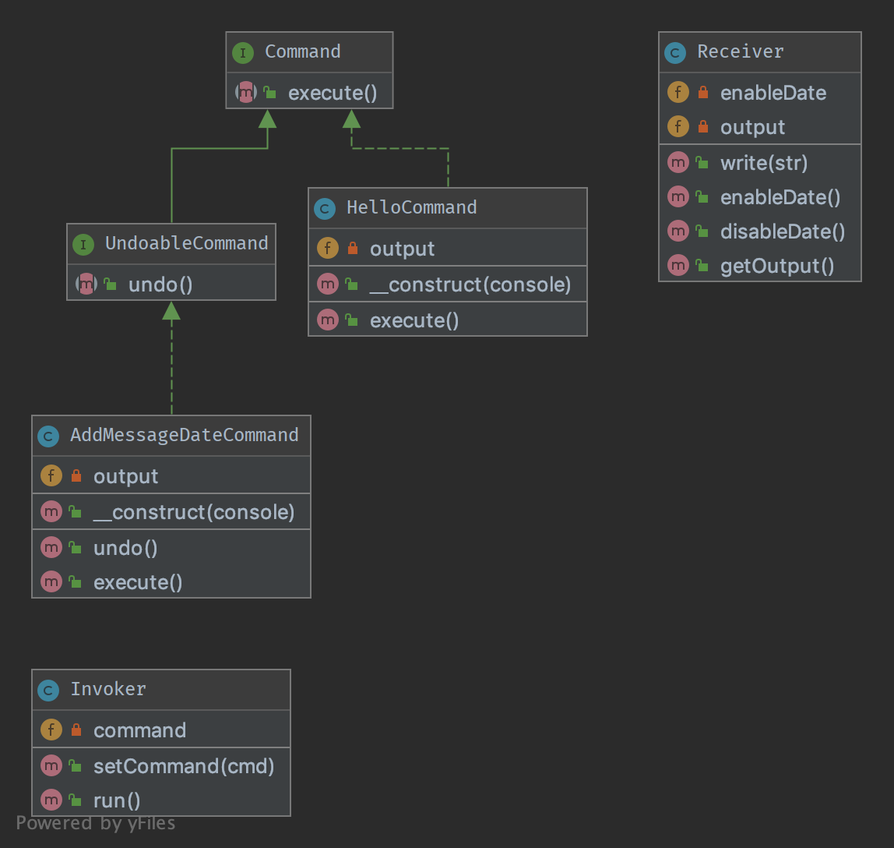

# 2. Команда (Command)

## Призначення

Інкапсулювати дію та її параметри

Припустимо, у нас є об'єкти Invoker (Командир) та Receiver (Виконавець). Цей патерн використовує реалізацію 
інтерфейсу «Команда», щоб викликати якийсь метод Виконавця використовуючи для цього відомий Командирові 
метод execute()». Командир просто знає, що потрібно викликати метод “execute()”, для обробки команди клієнта, 
не розбираючись у деталях реалізації Виконавця. Виконавець відокремлений від Командира.

Другим аспектом цього патерну є метод undo(), який скасовує дію, що виконується методом execute(). 
Команди також можуть бути об'єднані в більш загальні команди з мінімальним копіюванням-вставкою та покладаючись на 
композицію поверх успадкування.

## Приклади

Текстовий редактор: всі події є командами, які можуть бути скасовано, вибудувано в певну послідовність і збережено.

Великі утиліти для командного рядка (наприклад, Vagrant) використовують вкладені команди для поділу різних завдань 
та упаковування їх у «модулі», кожен з яких може бути реалізований за допомогою патерну «Команда».

## Діаграма UML



## Код
Ви можете знайти цей код на [GitHub](https://github.com/PetroOstapuk/DesignPatternsPHP/tree/main/Behavioral/Command)

```php title="Command.php"
<?php

declare(strict_types=1);

namespace DesignPatterns\Behavioral\Command;

interface Command
{
    /**
     * this is the most important method in the Command pattern,
     * The Receiver goes in the constructor.
     */
    public function execute();
}
```

```php title="UndoableCommand.php"
<?php

declare(strict_types=1);

namespace DesignPatterns\Behavioral\Command;

interface UndoableCommand extends Command
{
    /**
     * This method is used to undo change made by command execution
     */
    public function undo();
}
```

```php title="HelloCommand.php"
<?php

declare(strict_types=1);

namespace DesignPatterns\Behavioral\Command;

/**
 * This concrete command calls "print" on the Receiver, but an external
 * invoker just knows that it can call "execute"
 */
class HelloCommand implements Command
{
    /**
     * Each concrete command is built with different receivers.
     * There can be one, many or completely no receivers, but there can be other commands in the parameters
     */
    public function __construct(private Receiver $output)
    {
    }

    /**
     * execute and output "Hello World".
     */
    public function execute()
    {
        // sometimes, there is no receiver and this is the command which does all the work
        $this->output->write('Hello World');
    }
}
```

```php title="AddMessageDateCommand.php"
<?php

declare(strict_types=1);

namespace DesignPatterns\Behavioral\Command;

/**
 * This concrete command tweaks receiver to add current date to messages
 * invoker just knows that it can call "execute"
 */
class AddMessageDateCommand implements UndoableCommand
{
    /**
     * Each concrete command is built with different receivers.
     * There can be one, many or completely no receivers, but there can be other commands in the parameters.
     */
    public function __construct(private Receiver $output)
    {
    }

    /**
     * Execute and make receiver to enable displaying messages date.
     */
    public function execute()
    {
        // sometimes, there is no receiver and this is the command which
        // does all the work
        $this->output->enableDate();
    }

    /**
     * Undo the command and make receiver to disable displaying messages date.
     */
    public function undo()
    {
        // sometimes, there is no receiver and this is the command which
        // does all the work
        $this->output->disableDate();
    }
}
```

```php title="Receiver.php"
<?php

declare(strict_types=1);

namespace DesignPatterns\Behavioral\Command;

/**
 * Receiver is a specific service with its own contract and can be only concrete.
 */
class Receiver
{
    private bool $enableDate = false;

    /**
     * @var string[]
     */
    private array $output = [];

    public function write(string $str)
    {
        if ($this->enableDate) {
            $str .= ' [' . date('Y-m-d') . ']';
        }

        $this->output[] = $str;
    }

    public function getOutput(): string
    {
        return join("\n", $this->output);
    }

    /**
     * Enable receiver to display message date
     */
    public function enableDate()
    {
        $this->enableDate = true;
    }

    /**
     * Disable receiver to display message date
     */
    public function disableDate()
    {
        $this->enableDate = false;
    }
}
```

```php title="Invoker.php"
<?php

declare(strict_types=1);

namespace DesignPatterns\Behavioral\Command;

/**
 * Invoker is using the command given to it.
 * Example : an Application in SF2.
 */
class Invoker
{
    private Command $command;

    /**
     * in the invoker we find this kind of method for subscribing the command
     * There can be also a stack, a list, a fixed set ...
     */
    public function setCommand(Command $cmd)
    {
        $this->command = $cmd;
    }

    /**
     * executes the command; the invoker is the same whatever is the command
     */
    public function run()
    {
        $this->command->execute();
    }
}
```

## Тест

```php title="Tests/CommandTest.php"
<?php

declare(strict_types=1);

namespace DesignPatterns\Behavioral\Command\Tests;

use DesignPatterns\Behavioral\Command\HelloCommand;
use DesignPatterns\Behavioral\Command\Invoker;
use DesignPatterns\Behavioral\Command\Receiver;
use PHPUnit\Framework\TestCase;

class CommandTest extends TestCase
{
    public function testInvocation()
    {
        $invoker = new Invoker();
        $receiver = new Receiver();

        $invoker->setCommand(new HelloCommand($receiver));
        $invoker->run();
        $this->assertSame('Hello World', $receiver->getOutput());
    }
}
```

```php title="Tests/UndoableCommandTest.php"
<?php

declare(strict_types=1);

namespace DesignPatterns\Behavioral\Command\Tests;

use DesignPatterns\Behavioral\Command\AddMessageDateCommand;
use DesignPatterns\Behavioral\Command\HelloCommand;
use DesignPatterns\Behavioral\Command\Invoker;
use DesignPatterns\Behavioral\Command\Receiver;
use PHPUnit\Framework\TestCase;

class UndoableCommandTest extends TestCase
{
    public function testInvocation()
    {
        $invoker = new Invoker();
        $receiver = new Receiver();

        $invoker->setCommand(new HelloCommand($receiver));
        $invoker->run();
        $this->assertSame('Hello World', $receiver->getOutput());

        $messageDateCommand = new AddMessageDateCommand($receiver);
        $messageDateCommand->execute();

        $invoker->run();
        $this->assertSame("Hello World\nHello World [" . date('Y-m-d') . ']', $receiver->getOutput());

        $messageDateCommand->undo();

        $invoker->run();
        $this->assertSame("Hello World\nHello World [" . date('Y-m-d') . "]\nHello World", $receiver->getOutput());
    }
}
```

