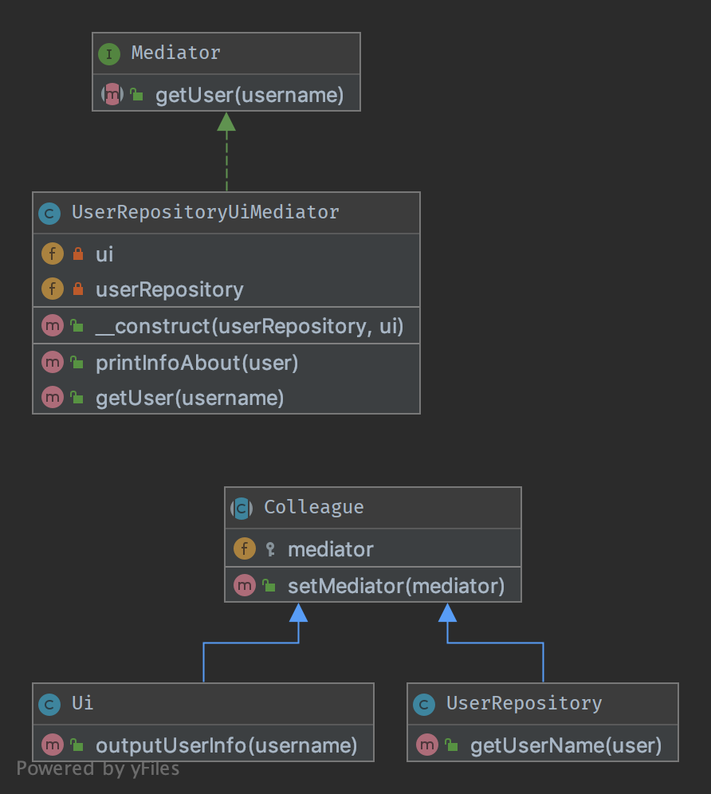

# 5. Посередник (Mediator)

## Призначення

Цей патерн дозволяє знизити зв'язність безлічі компонентів, що працюють спільно. Об'єктам більше немає потреби викликати
один одного безпосередньо. Це хороша альтернатива Спостерігачеві, якщо у вас є “центральна логіка” на кшталт 
контролера (але не в сенсі MVC)

Всі компоненти (звані «Колеги») об'єднуються в інтерфейс Mediator і це добре, тому що в рамках ООП, 
«старий друг краще нових двох».

## Діаграма UML



## Код
Ви можете знайти цей код на [GitHub](https://github.com/PetroOstapuk/DesignPatternsPHP/tree/main/Behavioral/Mediator)

```php title="Mediator.php"
<?php

declare(strict_types=1);

namespace DesignPatterns\Behavioral\Mediator;

interface Mediator
{
    public function getUser(string $username): string;
}
```

```php title="Colleague.php"
<?php

declare(strict_types=1);

namespace DesignPatterns\Behavioral\Mediator;

abstract class Colleague
{
    protected Mediator $mediator;

    final public function setMediator(Mediator $mediator)
    {
        $this->mediator = $mediator;
    }
}
```

```php title="Ui.php"
<?php

declare(strict_types=1);

namespace DesignPatterns\Behavioral\Mediator;

class Ui extends Colleague
{
    public function outputUserInfo(string $username)
    {
        echo $this->mediator->getUser($username);
    }
}
```

```php title="UserRepository.php"
<?php

declare(strict_types=1);

namespace DesignPatterns\Behavioral\Mediator;

class UserRepository extends Colleague
{
    public function getUserName(string $user): string
    {
        return 'User: ' . $user;
    }
}
```

```php title="UserRepositoryUiMediator.php"
<?php

declare(strict_types=1);

namespace DesignPatterns\Behavioral\Mediator;

class UserRepositoryUiMediator implements Mediator
{
    public function __construct(private UserRepository $userRepository, private Ui $ui)
    {
        $this->userRepository->setMediator($this);
        $this->ui->setMediator($this);
    }

    public function printInfoAbout(string $user)
    {
        $this->ui->outputUserInfo($user);
    }

    public function getUser(string $username): string
    {
        return $this->userRepository->getUserName($username);
    }
}
```

## Тест

```php title="Tests/MediatorTest.php"
<?php

declare(strict_types=1);

namespace DesignPatterns\Tests\Mediator\Tests;

use DesignPatterns\Behavioral\Mediator\Ui;
use DesignPatterns\Behavioral\Mediator\UserRepository;
use DesignPatterns\Behavioral\Mediator\UserRepositoryUiMediator;
use PHPUnit\Framework\TestCase;

class MediatorTest extends TestCase
{
    public function testOutputHelloWorld()
    {
        $mediator = new UserRepositoryUiMediator(new UserRepository(), new Ui());

        $this->expectOutputString('User: Dominik');
        $mediator->printInfoAbout('Dominik');
    }
}
```