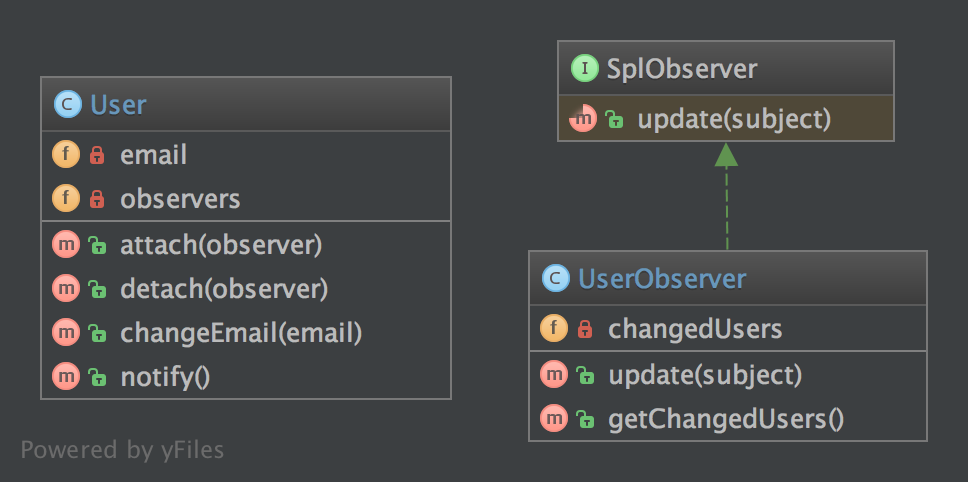

# 8. Спостерігач (Observer)

## Призначення

Для реалізації публікації/підписки на поведінку об'єкта, щоразу, коли об’єкт «Subject» змінює свій стан, 
прикріплені об'єкти «Observers» будуть повідомлені. Патерн використовується, щоб скоротити кількість 
пов'язаних безпосередньо об'єктів і замість цього використовує слабку зв'язність (loose coupling).

## Приклади

Система черги повідомлень спостерігає за чергами, щоб показувати прогрес у GUI.

## Примітка

PHP надає два стандартні інтерфейси, які можуть допомогти реалізувати цей шаблон: SplObserver та SplSubject.

## Діаграма UML



## Код
Ви можете знайти цей код на [GitHub](https://github.com/PetroOstapuk/DesignPatternsPHP/tree/main/Behavioral/Observer)

```php title="User.php"
<?php

declare(strict_types=1);

namespace DesignPatterns\Behavioral\Observer;

use SplSubject;
use SplObjectStorage;
use SplObserver;

/**
 * User implements the observed object (called Subject), it maintains a list of observers and sends notifications to
 * them in case changes are made on the User object
 */
class User implements SplSubject
{
    private SplObjectStorage $observers;
    private $email;

    public function __construct()
    {
        $this->observers = new SplObjectStorage();
    }

    public function attach(SplObserver $observer): void
    {
        $this->observers->attach($observer);
    }

    public function detach(SplObserver $observer): void
    {
        $this->observers->detach($observer);
    }

    public function changeEmail(string $email): void
    {
        $this->email = $email;
        $this->notify();
    }

    public function notify(): void
    {
        /** @var SplObserver $observer */
        foreach ($this->observers as $observer) {
            $observer->update($this);
        }
    }
}
```

```php title="UserObserver.php"
<?php

declare(strict_types=1);

namespace DesignPatterns\Behavioral\Observer;

use SplObserver;
use SplSubject;

class UserObserver implements SplObserver
{
    /**
     * @var SplSubject[]
     */
    private array $changedUsers = [];

    /**
     * It is called by the Subject, usually by SplSubject::notify()
     */
    public function update(SplSubject $subject): void
    {
        $this->changedUsers[] = clone $subject;
    }

    /**
     * @return SplSubject[]
     */
    public function getChangedUsers(): array
    {
        return $this->changedUsers;
    }
}
```

## Тест

```php title="Tests/ObserverTest.php"
<?php

declare(strict_types=1);

namespace DesignPatterns\Behavioral\Observer\Tests;

use DesignPatterns\Behavioral\Observer\User;
use DesignPatterns\Behavioral\Observer\UserObserver;
use PHPUnit\Framework\TestCase;

class ObserverTest extends TestCase
{
    public function testChangeInUserLeadsToUserObserverBeingNotified()
    {
        $observer = new UserObserver();

        $user = new User();
        $user->attach($observer);

        $user->changeEmail('foo@bar.com');
        $this->assertCount(1, $observer->getChangedUsers());
    }
}
```