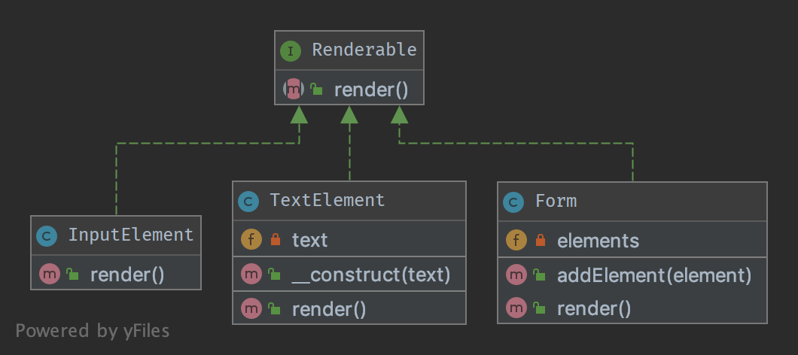

# Компонувальник (Composite)

## Призначення

Взаємодія з ієрархічною групою об'єктів так само як і з окремо взятим екземпляром.

## Приклади

Екземпляр класу Form обробляє всі свої елементи форми, як це один екземпляр. І коли викликається метод `render()`, 
він перебирає всі дочірні елементи і викликає їх власний `render()`.

## Діаграма UML



## Код

Ви можете знайти цей код на [GitHub](https://github.com/PetroOstapuk/DesignPatternsPHP/tree/main/Structural/Composite)

```php title="Renderable.php"
<?php

declare(strict_types=1);

namespace DesignPatterns\Structural\Composite;

interface Renderable
{
    public function render(): string;
}
```

```php title="Form.php"
<?php

declare(strict_types=1);

namespace DesignPatterns\Structural\Composite;

/**
 * The composite node MUST extend the component contract. This is mandatory for building
 * a tree of components.
 */
class Form implements Renderable
{
    /**
     * @var Renderable[]
     */
    private array $elements;

    /**
     * runs through all elements and calls render() on them, then returns the complete representation
     * of the form.
     *
     * from the outside, one will not see this and the form will act like a single object instance
     */
    public function render(): string
    {
        $formCode = '<form>';

        foreach ($this->elements as $element) {
            $formCode .= $element->render();
        }

        return $formCode . '</form>';
    }

    public function addElement(Renderable $element)
    {
        $this->elements[] = $element;
    }
}
```

```php title="InputElement.php"
<?php

declare(strict_types=1);

namespace DesignPatterns\Structural\Composite;

class InputElement implements Renderable
{
    public function render(): string
    {
        return '<input type="text" />';
    }
}
```

```php title="TextElement.php"
<?php

declare(strict_types=1);

namespace DesignPatterns\Structural\Composite;

class TextElement implements Renderable
{
    public function __construct(private string $text)
    {
    }

    public function render(): string
    {
        return $this->text;
    }
}
```

## Тест

```php title="Tests/CompositeTest.php"
<?php

declare(strict_types=1);

namespace DesignPatterns\Structural\Composite\Tests;

use DesignPatterns\Structural\Composite\Form;
use DesignPatterns\Structural\Composite\TextElement;
use DesignPatterns\Structural\Composite\InputElement;
use PHPUnit\Framework\TestCase;

class CompositeTest extends TestCase
{
    public function testRender()
    {
        $form = new Form();
        $form->addElement(new TextElement('Email:'));
        $form->addElement(new InputElement());
        $embed = new Form();
        $embed->addElement(new TextElement('Password:'));
        $embed->addElement(new InputElement());
        $form->addElement($embed);

        // This is just an example, in a real world scenario it is important to remember that web browsers do not
        // currently support nested forms

        $this->assertSame(
            '<form>Email:<input type="text" /><form>Password:<input type="text" /></form></form>',
            $form->render()
        );
    }
}
```