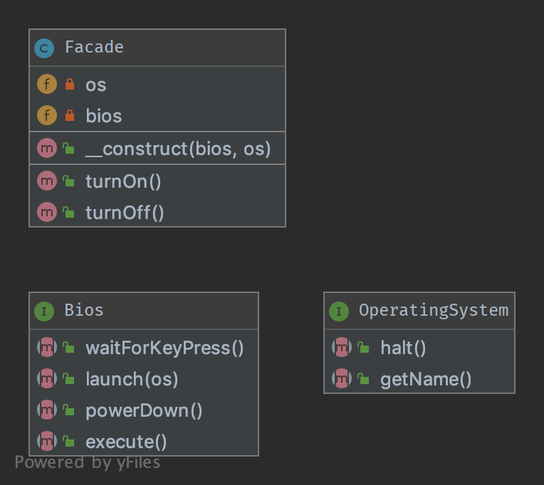

# 7. Фасад (Facade)

## Призначення

Основна мета шаблону фасаду полягає не в тому, щоб вам не потрібно було читати документацію API. 
Це лише побічний ефект. Перша мета — зменшити зв'язність і слідувати закону Деметри.

Фасад призначений для поділу клієнта та підсистеми шляхом впровадження багатьох (але іноді тільки одного) 
інтерфейсів, і, звичайно, зменшення загальної складності.

Фасад не забороняє прямий доступ до підсистеми. Просто він робить його простіше і зрозуміліше.

Ви можете (і вам варто) мати кілька фасадів для однієї підсистеми.

Ось чому хороший фасад не містить створення екземплярів класів (`new`) всередині. Якщо всередині фасаду створюються
об'єкти для реалізації кожного методу, це не Фасад, це Будівельник або [Абстрактна|Статична|Проста] 
Фабрика [або Фабричний Метод].

Кращий фасад не містить `new` або конструктора з type-hinted параметрами. Якщо вам необхідно створювати нові 
екземпляри класів, в такому випадку краще використовувати Фабрику як аргумент.

## Діаграма UML



## Код
Ви можете знайти цей код на [GitHub](https://github.com/PetroOstapuk/DesignPatternsPHP/tree/main/Structural/Facade)

```php title="Facade.php"
<?php

declare(strict_types=1);

namespace DesignPatterns\Structural\Facade;

class Facade
{
    public function __construct(private Bios $bios, private OperatingSystem $os)
    {
    }

    public function turnOn()
    {
        $this->bios->execute();
        $this->bios->waitForKeyPress();
        $this->bios->launch($this->os);
    }

    public function turnOff()
    {
        $this->os->halt();
        $this->bios->powerDown();
    }
}
```

```php title="OperatingSystem.php"
<?php

declare(strict_types=1);

namespace DesignPatterns\Structural\Facade;

interface OperatingSystem
{
    public function halt();

    public function getName(): string;
}
```

```php title="Bios.php"
<?php

declare(strict_types=1);

namespace DesignPatterns\Structural\Facade;

interface Bios
{
    public function execute();

    public function waitForKeyPress();

    public function launch(OperatingSystem $os);

    public function powerDown();
}
```

## Тест

```php title="Tests/FacadeTest.php"
<?php

declare(strict_types=1);

namespace DesignPatterns\Structural\Facade\Tests;

use DesignPatterns\Structural\Facade\Bios;
use DesignPatterns\Structural\Facade\Facade;
use DesignPatterns\Structural\Facade\OperatingSystem;
use PHPUnit\Framework\TestCase;

class FacadeTest extends TestCase
{
    public function testComputerOn()
    {
        $os = $this->createMock(OperatingSystem::class);

        $os->method('getName')
            ->will($this->returnValue('Linux'));

        $bios = $this->createMock(Bios::class);

        $bios->method('launch')
            ->with($os);

        /** @noinspection PhpParamsInspection */
        $facade = new Facade($bios, $os);
        $facade->turnOn();

        $this->assertSame('Linux', $os->getName());
    }
}
```