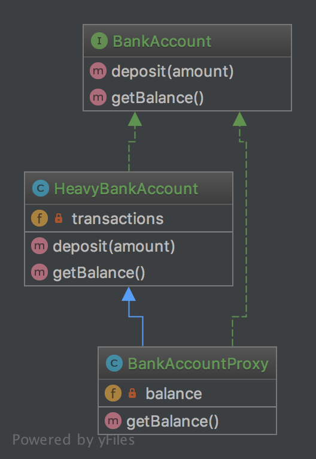

# 10. Замісник (Proxy)

## Призначення

Створити інтерфейс взаємодії з будь-яким класом, який важко чи неможливо використовувати в оригінальному вигляді.

## Приклади

Doctrine2 використовує проксі для реалізації магії фреймворку (наприклад, для ледачої ініціалізації), 
в той час, як користувач працює зі своїми власними класами сутностей і ніколи не буде використовувати проксі.

## Діаграма UML



## Код
Ви можете знайти цей код на [GitHub](https://github.com/PetroOstapuk/DesignPatternsPHP/tree/main/Structural/Proxy)

```php title="BankAccount.php"
<?php

declare(strict_types=1);

namespace DesignPatterns\Structural\Proxy;

interface BankAccount
{
    public function deposit(int $amount);

    public function getBalance(): int;
}
```

```php title="HeavyBankAccount.php"
<?php

declare(strict_types=1);

namespace DesignPatterns\Structural\Proxy;

class HeavyBankAccount implements BankAccount
{
    /**
     * @var int[]
     */
    private array $transactions = [];

    public function deposit(int $amount)
    {
        $this->transactions[] = $amount;
    }

    public function getBalance(): int
    {
        // this is the heavy part, imagine all the transactions even from
        // years and decades ago must be fetched from a database or web service
        // and the balance must be calculated from it

        return array_sum($this->transactions);
    }
}
```

```php title="BankAccountProxy.php"
<?php

declare(strict_types=1);

namespace DesignPatterns\Structural\Proxy;

class BankAccountProxy extends HeavyBankAccount implements BankAccount
{
    private ?int $balance = null;

    public function getBalance(): int
    {
        // because calculating balance is so expensive,
        // the usage of BankAccount::getBalance() is delayed until it really is needed
        // and will not be calculated again for this instance

        if ($this->balance === null) {
            $this->balance = parent::getBalance();
        }

        return $this->balance;
    }
}
```

## Тест

```php title="Tests/ProxyTest.php"
<?php

declare(strict_types=1);

namespace DesignPatterns\Structural\Proxy\Tests;

use DesignPatterns\Structural\Proxy\BankAccountProxy;
use PHPUnit\Framework\TestCase;

class ProxyTest extends TestCase
{
    public function testProxyWillOnlyExecuteExpensiveGetBalanceOnce()
    {
        $bankAccount = new BankAccountProxy();
        $bankAccount->deposit(30);

        // this time balance is being calculated
        $this->assertSame(30, $bankAccount->getBalance());

        // inheritance allows for BankAccountProxy to behave to an outsider exactly like ServerBankAccount
        $bankAccount->deposit(50);

        // this time the previously calculated balance is returned again without re-calculating it
        $this->assertSame(30, $bankAccount->getBalance());
    }
}
```