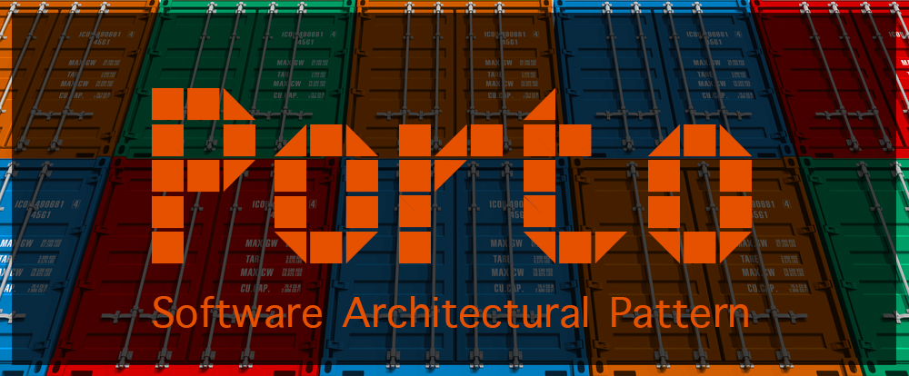
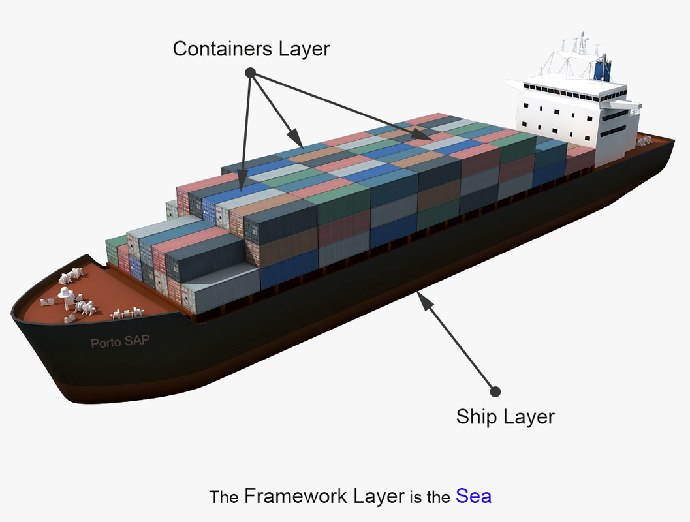
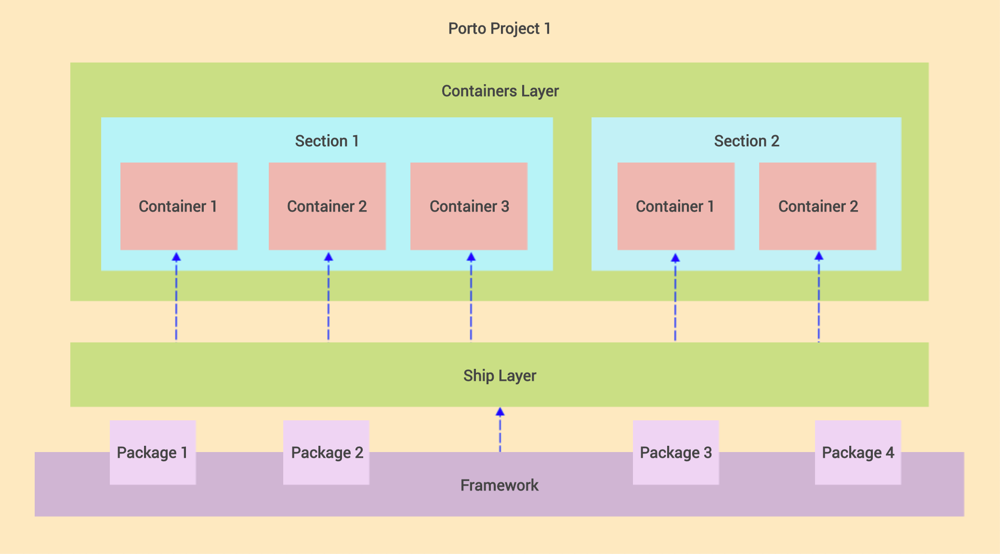

# Porto - архітектурний патерн

Porto - це сучасний архітектурний патерн програмного забезпечення, який масштабується разом з вашим бізнесом!

## Переклад

* 🇺🇦 **Ukrainian:**
    * [Mahmoudz/Porto](https://github.com/PetroOstapuk/Porto)

## Вступ

**Porto** - це сучасний архітектурний патерн програмного забезпечення, що складається з настанов, принципів і шаблонів, 
які допомагають розробникам організовувати свій код у спосіб, який легко підтримувати й використовувати повторно.

Porto є чудовим варіантом для середніх та великих вебпроєктів, оскільки вони, як правило, мають тенденцію до зростання 
складності з часом.

За допомогою Porto розробники можуть створювати супермасштабовані монолітні системи, які можна легко розділити 
на декілька мікросервісів за потреби.
Уможливлюючи багаторазове використання бізнес-логіки *(Application Features)* в різних проєктах.

**Porto** успадковує концепції від **DDD** _(Domain Driven Design)_, **Modular**, **Micro Kernel**, 
**MVC** _(Model View Controller)_, **Layered** і **ADR** _(Action Domain Responder)_ архітектур.

І він дотримується переліку зручних принципів дизайну, таких як  **SOLID**, **OOP**, **LIFT**, **DRY**, **CoC**, 
**GRASP**, **Generalization**, **High Cohesion** and **Low Coupling**.

Вона починалася як експериментальна архітектура, спрямована на розв'язання загальних проблем, з якими стикаються 
веброзробники при створенні великих проєктів.

_Відгуки та внески вітаються._

> "Простота є передумовою надійності". - Едсгер Дейкстра

## Починаємо

### Огляд шарів

За своєю суттю Porto складається з 2 шарів-"папок": "Контейнери" та "Корабель".

- Шар "Контейнери" містить весь код бізнес-логіки вашого додатка.
- Шар "Корабель" містить код інфраструктури (ваш спільний код між усіма контейнерами).

Ці шари можуть бути створені будь-де всередині будь-якого фреймворку на ваш вибір.

*(Приклад: у Laravel або Rails вони можуть бути створені у каталозі `app/` або у новому каталозі `src/` 
у кореневому каталозі проєкту.)*

Перш ніж зануритися глибше, розберімось з різними рівнями коду, які ми матимемо у вашій кодовій базі:

### Рівні коду

- **Низькорівневий код**: код фреймворку (реалізує базові операції, такі як читання файлів з диска або взаємодія 
з базою даних). Зазвичай знаходиться в каталозі Vendor.
- **Код середнього рівня**: загальний код програми (реалізує функціональність, яка обслуговує код високого рівня. 
І покладається на низькорівневий код для функціонування). Має бути в шарі `Корабель`.
- **Високорівневий код**: код бізнес-логіки (інкапсулює складну логіку і покладається на код середнього рівня 
для функціонування). Має бути в шарі `Контейнери`.

### Діаграма шарів

Шар Containers (вантажні контейнери) `>> покладається >>` на шар Ship (вантажний корабель) `>> покладається >>`
на Framework (море).

 

### Від монолітних до мікросервісів

Porto створений, щоб масштабуватися разом з вами! У той час як більшість компаній переходять від монолітних 
до мікросервісів *(а останнім часом і без серверних)*, коли вони масштабуються. Porto пропонує гнучкість, 
щоб у будь-який час з найменшими зусиллями перетворити вашу монолітну структуру на мікросервіси (або SOA).

У термінах Porto, монолітна система дорівнює одному вантажному кораблю з контейнерами, в той час, 
як мікросервіси дорівнюють декільком вантажним кораблям з контейнерами. *(Незалежно від їх розміру)*.

Порто пропонує гнучкість, що дозволяє почати з одного добре організованого монолітного сервісу й розширюватися, 
коли це необхідно, шляхом розподілу контейнерів на кілька сервісів у міру зростання вашої команди.

Це можливо завдяки тому, що Porto організовує ваш код у Контейнери, які групуються в ізольовані Секції. 
Пізніше секцію можна витягти разом з усіма пов'язаними з нею контейнерами, щоб розгорнути їх окремо 
в міру масштабування.

Як ви можете собі уявити, експлуатація двох або більше кораблів у морі замість одного, збільшить вартість 
обслуговування (два репозиторії, два пайплайни CI, ...), але також надасть вам гнучкість, 
коли кожен корабель може рухатися з різною швидкістю і в різному напрямку. Технічно це означає, 
що кожна служба масштабується по-різному, залежно від очікуваного трафіку.

Те, як розділи "Сервіси" взаємодіють між собою, повністю залежить від розробників, хоча Porto рекомендує 
використовувати події та/або команди.