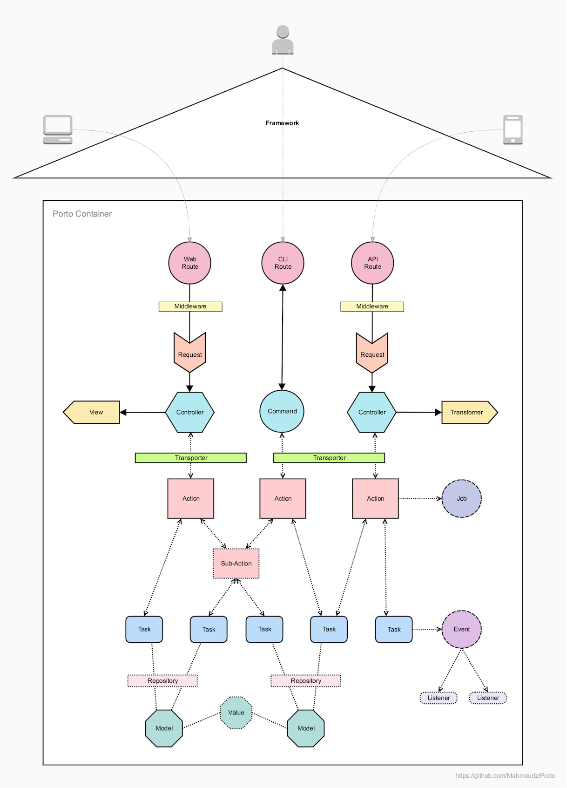

# Porto - архітектурний патерн


Porto - це сучасний архітектурний патерн програмного забезпечення, який масштабується разом з вашим бізнесом!

## Переклад

* 🇺🇦 **Репозиторій:**
    * [PetroOstapuk/Porto](https://github.com/PetroOstapuk/Porto)

## Вступ

**Porto** - це сучасний архітектурний патерн програмного забезпечення, що складається з настанов, принципів і шаблонів, 
які допомагають розробникам організовувати свій код у спосіб, який легко підтримувати й використовувати повторно.

Porto є чудовим варіантом для середніх та великих вебпроєктів, оскільки вони, як правило, мають тенденцію до зростання 
складності з часом.

За допомогою Porto розробники можуть створювати супермасштабовані монолітні системи, які можна легко розділити 
на декілька мікросервісів за потреби.
Уможливлюючи багаторазове використання бізнес-логіки *(Application Features)* в різних проєктах.

**Porto** успадковує концепції від **DDD** _(Domain Driven Design)_, **Modular**, **Micro Kernel**, 
**MVC** _(Model View Controller)_, **Layered** і **ADR** _(Action Domain Responder)_ архітектур.

І він дотримується переліку зручних принципів дизайну, таких як  **SOLID**, **OOP**, **LIFT**, **DRY**, **CoC**, 
**GRASP**, **Generalization**, **High Cohesion** and **Low Coupling**.

Вона починалася як експериментальна архітектура, спрямована на розв'язання загальних проблем, з якими стикаються 
веброзробники при створенні великих проєктів.

_Відгуки та внески вітаються._

> "Простота є передумовою надійності". - Едсгер Дейкстра

## Починаємо

### Огляд шарів

За своєю суттю Porto складається з 2 шарів-"папок": "Контейнери" та "Корабель".

- Шар "Контейнери" містить весь код бізнес-логіки вашого додатка.
- Шар "Корабель" містить код інфраструктури (ваш спільний код між усіма контейнерами).

Ці шари можуть бути створені будь-де всередині будь-якого фреймворку на ваш вибір.

*(Приклад: у Laravel або Rails вони можуть бути створені у каталозі `app/` або у новому каталозі `src/` 
у кореневому каталозі проєкту.)*


Перш ніж зануритися глибше, розберімось з різними рівнями коду, які ми матимемо у вашій кодовій базі:

### Рівні коду

- **Низькорівневий код**: код фреймворку (реалізує базові операції, такі як читання файлів з диска або взаємодія 
з базою даних). Зазвичай знаходиться в каталозі Vendor.
- **Код середнього рівня**: загальний код програми (реалізує функціональність, яка обслуговує код високого рівня. 
І покладається на низькорівневий код для функціонування). Має бути в шарі `Корабель`.
- **Високорівневий код**: код бізнес-логіки (інкапсулює складну логіку і покладається на код середнього рівня 
для функціонування). Має бути в шарі `Контейнери`.

### Діаграма шарів

Шар Containers (вантажні контейнери) `>> покладається >>` на шар Ship (вантажний корабель) `>> покладається >>`
на Framework (море).

 

### Від моноліту до "Мікро" сервісів

Porto створений, щоб масштабуватися разом з вами! У той час як більшість компаній переходять від монолітних 
до мікросервісів *(а останнім часом і без серверних)*, коли вони масштабуються. Porto пропонує гнучкість, 
щоб у будь-який час з найменшими зусиллями перетворити вашу монолітну структуру на мікросервіси (або SOA).

У термінах Porto, монолітна система дорівнює одному вантажному кораблю з контейнерами, в той час, 
як мікросервіси дорівнюють декільком вантажним кораблям з контейнерами. *(Незалежно від їх розміру)*.

Порто пропонує гнучкість, що дозволяє почати з одного добре організованого монолітного сервісу й розширюватися, 
коли це необхідно, шляхом розподілу контейнерів на кілька сервісів у міру зростання вашої команди.

Це можливо завдяки тому, що Porto організовує ваш код у Контейнери, які групуються в ізольовані Секції. 
Пізніше секцію можна витягти разом з усіма пов'язаними з нею контейнерами, щоб розгорнути їх окремо 
в міру масштабування.

Як ви можете собі уявити, експлуатація двох або більше кораблів у морі замість одного, збільшить вартість 
обслуговування (два репозиторії, два пайплайни CI, ...), але також надасть вам гнучкість, 
коли кожен корабель може рухатися з різною швидкістю і в різному напрямку. Технічно це означає, 
що кожна служба масштабується по-різному, залежно від очікуваного трафіку.

Те, як розділи "Сервіси" взаємодіють між собою, повністю залежить від розробників, хоча Porto рекомендує 
використовувати події та/або команди.

### 1) Корабельний рівень

Шар Корабель містить батьківські "базові" класи *(класи, розширені кожним окремим компонентом)* і деякий 
Код Утиліт.

Батьківські класи "Базові класи" шару Корабля дають повний контроль над Компонентами Контейнера *(наприклад, 
додавання функції до класу Базової Моделі робить її доступною для кожної Моделі у вашому Контейнері).*

Рівень корабля також відіграє важливу роль у відокремленні коду програми від коду фреймворку. Це полегшує 
оновлення фреймворку, не впливаючи на код програми.

У Porto рівень корабля дуже тонкий, він НЕ містить загальних функцій багаторазового використання, таких як 
автентифікація або авторизація, оскільки всі ці функції надаються контейнерами, які можна замінити за потреби. 
Це дає розробникам більше гнучкості.

#### Структура корабля

Шар Корабель містить наступні типи кодів:

- **Основний код**: це двигун корабля, який автоматично реєструє й автоматично завантажує всі компоненти 
вашого Контейнера для завантаження вашого додатка. Він містить більшу частину магічного коду, який обробляє все, 
що не є частиною вашої бізнес-логіки. І здебільшого містить код, який полегшує розробку, розширюючи можливості 
фреймворку.
- **Контейнери зі спільним кодом**.
  - **Батьківські класи**: базові класи кожного компонента у вашому контейнері. (Додавання функцій до 
  батьківських класів робить їх доступними в кожному контейнері). Батьківські класи призначені для спільного 
  використання коду між вашими Контейнерами.
  - Загальні класи (Generic Classes): багаторазово використовувані функції та класи, які можуть бути використані 
  кожним Контейнером. Наприклад, глобальні винятки, проміжне програмне забезпечення, глобальні конфігураційні 
  файли тощо.

Примітка: Усі Компоненти Контейнера ПОВИННІ розширювати або успадковувати рівень корабля *(зокрема, батьківську папку)*.

Якщо ви відокремлюєте **Ядро** у зовнішній пакет, Батьки Корабля повинні розширюватися від Батьків Ядра 
(можуть бути названі Абстрактними, оскільки більшість з них мають бути абстрактними класами).
Батьки-кораблі містять спільну бізнес-логіку вашого додатка, тоді як батьки-ядра (абстрактні класи) містять 
спільний код фреймворку, тобто все, що не є бізнес-логікою, повинно бути приховано від реального додатку, 
що розробляється.

### 2) Рівень контейнерів

Porto керує складністю проблеми, розбиваючи її на менші керовані контейнери.

Рівень контейнерів - це місце, де живе бізнес-логіка конкретного додатка *(особливості/функціональність додатка)*. 
На цьому рівні ви проведете 90% свого часу.

#### Контейнери

Контейнер може бути **функцією**, або обгорткою навколо ресурсу RESTful API, або будь-чим іншим.


##### Приклад 1:

"У додатку TODO, об'єкти "Завдання", "Користувач" і "Календар" будуть жити в різних контейнерах, де кожен з них має 
власні маршрути, контролери, моделі, винятки тощо. І кожен Контейнер відповідає за отримання запитів і повернення 
відповідей з будь-якого підтримуваного інтерфейсу (Web, API...)".

Рекомендується використовувати одну модель на контейнер, проте в деяких випадках вам може знадобитися більше 
однієї моделі, і це цілком нормально.
(Навіть якщо у вас є одна модель, ви також можете мати Значення "AKA Value Objects" (Значення схожі на моделі, 
але не представлені в БД у власних таблицях, а як дані моделей); ці об'єкти створюються автоматично після того, 
як дані про них отримуються з БД, такі як Ціна, Місцезнаходження, Час...).

Просто майте на увазі, що дві Моделі означають два Сховища, два Трансформери й т.д.
Якщо ви не хочете використовувати обидві моделі завжди разом, розділіть їх на 2 контейнери.

Примітка: якщо між двома контейнерами існує висока залежність, то розміщення їх в одній секції полегшить їх повторне 
використання в інших проєктах.

##### Приклад 2:

Якщо ви подивитеся на [Apiato](http://apiato.io) (перший проєкт, що реалізує Porto), ви помітите, 
що автентифікація та авторизація є функціями, наданими у вигляді контейнерів.

#### Базова структура контейнера

```
Container 1
	├── Actions
	├── Tasks
	├── Models
	└── UI
	    ├── WEB
	    │   ├── Routes
	    │   ├── Controllers
	    │   └── Views
	    ├── API
	    │   ├── Routes
	    │   ├── Controllers
	    │   └── Transformers
	    └── CLI
	        ├── Routes
	        └── Commands

Container 2
	├── Actions
	├── Tasks
	├── Models
	└── UI
	    ├── WEB
	    │   ├── Routes
	    │   ├── Controllers
	    │   └── Views
	    ├── API
	    │   ├── Routes
	    │   ├── Controllers
	    │   └── Transformers
	    └── CLI
	        ├── Routes
	        └── Commands
```

#### Контейнери Комунікації

- Контейнер МОЖЕ залежати від одного або багатьох інших контейнерів. *(У межах однієї секції.)*.
- Контролер МОЖЕ викликати Завдання з іншого Контейнера.
- Модель МОЖЕ мати зв'язок з моделлю з іншого контейнера.
- Можливі також інші форми зв'язку, наприклад, за допомогою подій та команд.

*Якщо ви використовуєте зв'язок між контейнерами на основі подій, ви можете використовувати той самий механізм 
після розділення вашої кодової бази на декілька сервісів.

> Примітка: Якщо ви не знайомі з поділом коду на Модулі/Домени, або з якихось причин не віддаєте перевагу 
> такому підходу. Ви можете створити весь ваш додаток в одному контейнері. (Не рекомендується, але цілком можливо).

### Секції

Секція - ще один дуже важливий аспект архітектури Порту.

Секція - це група пов'язаних між собою контейнерів. Це може бути **сервіс** _(мікро або більший)_, або підсистема 
в межах основної системи, або будь-що інше.

*Уявіть собі секцію як ряд контейнерів на вантажному судні. Добре організовані контейнери в рядах прискорюють 
завантаження і розвантаження суміжних контейнерів для конкретного клієнта.*.

Базове визначення секції - це тека, яка містить пов'язані між собою контейнери. Однак, переваги секції величезні 
(секція еквівалентна обмеженому контексту з дизайну, керованого доменом). Кожна секція представляє частину вашої 
системи й повністю ізольована від інших секцій.

Секцію можна розгортати окремо.

#### Приклад 1:

Якщо ви розробляєте гру, таку як Need for Speed, ви можете мати наступні дві секції: Секція перегонів і Секція лобі, 
де кожна секція містить Контейнер автомобіля і Модель автомобіля всередині нього, але з різними властивостями й 
функціями.
У цьому прикладі модель автомобіля секції "Перегони" може містити бізнес-логіку для прискорення й управління 
автомобілем, в той час, як модель автомобіля секції лобі містить бізнес-логіку для налаштування автомобіля 
(колір, аксесуари...) перед перегонами.

Секції дозволяють розділяти великі моделі на менші. І вони можуть визначати межі для різних Моделей у вашій системі.

Якщо ви віддаєте перевагу простоті або над проєктом працює лише одна команда, ви можете взагалі не використовувати 
Секції (коли всі Контейнери знаходяться в теці containers), що означає, що ваш проєкт - це одна секція. 
У цьому випадку, якщо проєкт швидко розростається і ви вирішили, що потрібно почати використовувати секції, 
ви можете створити новий проєкт також з однією секцією, це називається Мікро-Сервіси (Micro-Services). 
У Micro-Services кожна секція "частина проєкту" живе у власному проєкті (репозиторії) і вони можуть спілкуватися 
мережею, зазвичай використовуючи протокол HTTP.

#### Example 2:

У типовому додатку для електронної комерції ви можете мати такі секції: Розділ інвентаризації, розділ доставки, 
розділ замовлень, розділ оплати, розділ каталогу та інші...

Як ви можете собі уявити, кожен з цих розділів може бути мікросервісом сам по собі.
І може бути витягнутий і розгорнутий на власному сервері на основі трафіку, який він отримує.

#### Зв'язок між секціями

- Секція ПОВИННА бути ізольованою і НЕ ПОВИННА залежати від будь-якої іншої секції.
- Секція МОЖЕ прослуховувати події, відправлені іншими секціями. (Команди можуть використовуватися як 
альтернатива Подіям).

## Компоненти

У шарі Container є набір "класів" `Components` із заздалегідь визначеними обов'язками.

Кожен фрагмент коду, який ви пишете, повинен жити у компоненті (функції класу). Porto визначає для вас величезний 
список цих компонентів, з набором інструкцій, яких слід дотримуватися при їх використанні, щоб зробити процес розробки 
безперебійним.

Компоненти забезпечують узгодженість і полегшують підтримку вашого коду, оскільки ви вже знаєте, де знаходиться 
кожен фрагмент коду.

### Типи компонентів

Кожен контейнер складається з певної кількості компонентів, у **Porto** компоненти поділяються на два типи:
`Основні компоненти` та `Додаткові компоненти`.

### 1) Основні компоненти

Ви повинні використовувати ці компоненти, оскільки вони потрібні майже для всіх типів вебдодатків:

Routes - Controllers - Requests - Actions - Tasks - Models - Views - Transformers.

> **Views:** слід використовувати, якщо додаток працює з HTML-сторінками.
> <br/>
> **Transformers:** слід використовувати, якщо додаток працює з JSON або XML даними.

### 1.1) Діаграма взаємодії основних компонентів



### 1.2) Життєвий цикл запиту

*Базовий сценарій виклику API, навігація основними компонентами:*.

1. **User** викликає `Endpoint` у файлі `Route`.
2. `Endpoint` викликає `Middleware` для обробки аутентифікації.
3. `Endpoint` викликає свою функцію `Controller`.
4. Запит `Request`, введений в `Controller`, автоматично застосовує правила перевірки та авторизації запиту.
5. `Controller` викликає `Action` і передає йому дані кожного `Request`.
6. `Action` виконує бізнес-логіку, *АБО може викликати стільки `Tasks`, скільки потрібно для виконання 
багаторазових підмножин бізнес-логіки*.
7. `Tasks` виконують багаторазову підмножину бізнес-логіки (`Tasks` може виконувати одну частину основної `Action`).
8. `Action` готує дані для повернення до `Controller`, *деякі дані можуть бути зібрані з `Tasks`*.
9. `Controller` формує відповідь за допомогою `View` (або `Transformer`) і надсилає її назад **User**.

### 1.3) Визначення та принципи основних компонентів

> Натисніть на стрілки нижче, щоб прочитати про кожен компонент.

<Details>
<Summary>Routes</Summary>
<br>

Routes є першими отримувачами HTTP-запитів.

Маршрути відповідають за зіставлення всіх вхідних HTTP-запитів з функціями контролера.

Файли маршрутів містять ендпойнти (шаблони URL-адрес, які ідентифікують вхідний запит).

Коли HTTP-запит потрапляє до вашої програми, ендпойнти збігаються з шаблоном URL-адреси й викликають відповідну 
функцію контролера.

#### Принципи:
- Існує три типи маршрутів: маршрути API, вебмаршрути та маршрути CLI.
- Файли API Routes ПОВИННІ бути відокремлені від файлів Web Routes, кожен у своїй власній теці.
- Тека Web Routes буде містити тільки Web ендпойнти (доступні для веббраузера); а тека API Routes буде містити 
тільки ендпойнти API (доступні для будь-якого споживчого додатка).
- Кожен контейнер ПОВИНЕН мати власні маршрути.
- Кожен файл маршруту ПОВИНЕН містити єдиний ендпойнт.
- Завданням ендпойнту є виклик функції на відповідному Контролері після отримання запиту будь-якого типу. 
(Він НЕ ПОВИНЕН робити нічого іншого).

***

</Details>

<Details>
<Summary>Controllers</Summary>
<br>
Контролери відповідають за перевірку запиту, обслуговування даних запиту та формування відповіді. *Перевірка та 
відповідь відбуваються в окремих класах, але запускаються контролером*.

Концепція контролерів така ж, як і у MVC *(вони є C у MVC)*, але з обмеженими й заздалегідь визначеними обов'язками.

#### Принципи:
- Контролери НЕ ПОВИННІ знати нічого про бізнес-логіку або про будь-який бізнес-об'єкт.
- Контролер ПОВИНЕН виконувати лише наступну роботу:
  1. Читання даних запиту (введення користувачем)
  2. Виклик дії (і передача їй даних запиту)
  3. Створення відповіді (зазвичай відповідь створюється на основі даних, отриманих від виклику дії)
- Контролери НЕ ПОВИННІ мати жодної форми бізнес-логіки. (Він ПОВИНЕН викликати дію для виконання бізнес-логіки).
- Контролери НЕ повинні викликати контейнерні завдання. Вони МОЖУТЬ викликати тільки дії. (А потім дії можуть 
викликати контейнерні завдання).
- Контролери можуть бути викликані лише Routes Endpoints.
- Кожна папка контейнерного інтерфейсу (Web, API, CLI) матиме власні контролери.

Ви можете запитати, навіщо нам потрібен контролер, якщо ми можемо безпосередньо викликати дію з маршруту. 
Рівень контролерів допомагає зробити дію багаторазово використовуваною в різних інтерфейсах (Web & API), оскільки 
він не створює відповідь, а це зменшує кількість дублювання коду в різних інтерфейсах.

Ось приклад нижче:

- Інтерфейс (Web): Маршрут `W-R1` -> Контролер `W-C1` -> Дія `A1`.
- ІНТЕРФЕЙС (API): Маршрут `A-R1` -> Контролер `A-C1` -> Дія `A1`.

Як ви можете бачити в прикладі вище, Action `A1` було використано обома маршрутами `W-R1` і `A-R1`, 
за допомогою шару Controllers, який живе в кожному UI.

***

</Details>

<Details>
<Summary>Requests</Summary>
<br>

Запити в основному слугують для введення даних користувачем у додатку. І вони дуже корисні для автоматичного 
застосування правил валідації та авторизації.

Запити є найкращим місцем для застосування валідації, оскільки правила валідації будуть пов'язані з кожним запитом.
Запити також можуть перевіряти авторизацію, наприклад, перевіряти, чи має цей користувач доступ до цієї функції 
контролера.
*(Приклад: перевірка того, чи певний користувач є власником продукту, перш ніж видалити його, або перевірка того, 
чи є цей користувач адміністратором для редагування чогось).*

#### Принципи:
- Запит МОЖЕ містити правила перевірки/авторизації.
- Запити ПОВИННІ вводитися тільки в контролери. Після введення вони автоматично перевіряють, чи відповідають дані 
запиту правилам валідації, і якщо вхідні дані запиту не є дійсними, буде згенеровано виняток (Exception).
- Запити МОЖНА також використовувати для авторизації, вони можуть перевіряти, чи користувач має право робити запит.

***

</Details>

<Details>
<Summary>Actions</Summary>
<br>

Actions представляють Варіанти використання Програми *(дії, які можуть бути виконані Користувачем або Програмою 
в Програмі)*.

Дії МОЖУТЬ містити бізнес-логіку та/або організовувати Завдання для виконання бізнес-логіки.

Дії отримують структури даних як вхідні дані, маніпулюють ними відповідно до бізнес-правил внутрішньо 
або за допомогою деяких Завдань, а потім виводять нові структури даних.

Дії НЕ ПОВИННІ дбати про те, як зібрані дані або як вони будуть представлені.

Просто подивившись на теку Дій Контейнера, ви можете визначити, які варіанти використання (функції) надає 
ваш Контейнер.
А переглянувши всі Дії, ви можете визначити, що може робити Додаток.

#### Принципи:
- Кожна дія ПОВИННА відповідати за виконання одного варіанту використання в додатку.
- Дія МОЖЕ отримувати дані від Завдань і передавати їх іншому Завданню.
- Дія МОЖЕ викликати декілька Завдань. (Вони навіть можуть викликати Задачі з інших Контейнерів!).
- Дії МОЖУТЬ повертати дані Контролеру.
- Дії НЕ ПОВИННІ повертати відповідь. (Повертати відповідь - це робота контролера).
- Дія НЕ повинна викликати іншу дію (якщо вам потрібно повторно використовувати великий фрагмент бізнес-логіки 
в декількох діях, і цей фрагмент викликає деякі завдання, ви можете створити "під дію"). Див. розділ "Під дії" нижче.
- Дії в основному використовуються контролерами. Однак їх можна використовувати зі слухачів подій, команд та/або 
інших класів. Але їх НЕ МОЖНА використовувати із Завдань.
- Кожна дія ПОВИННА мати лише одну функцію з назвою `run()`.
- Головна функція дії `run()` може приймати об'єкт запиту як параметр.
- Дії відповідають за обробку всіх очікуваних винятків.

***

</Details>

<Details>
<Summary>Tasks</Summary>
<br>

Завдання - це класи, які містять спільну бізнес-логіку між декількома діями в різних Контейнерах.

Кожна задача відповідає за невелику частину логіки.

Завдання не є обов'язковими, але в більшості випадків вони вам знадобляться.

Приклад: якщо у вас є Дія 1, яка повинна знайти запис за його ідентифікатором у базі даних, а потім згенерувати подію.
І у вас є Дія 2, яка повинна знайти той самий запис за його ID, а потім зробити виклик до зовнішнього API.
Оскільки обидві дії виконують логіку "знайти запис за ідентифікатором", ми можемо взяти цю бізнес-логіку і помістити 
її в окремий клас, цим класом є Задача. Тепер це завдання можна використовувати повторно в обох діях і в будь-якій 
іншій дії, яку ви можете створити в майбутньому.

Правило полягає в тому, що коли ви бачите можливість повторного використання частини коду з дії, ви повинні 
помістити цю частину коду в задачу. Не створюйте завдання для всього наосліп, ви завжди можете почати з написання 
всієї бізнес-логіки в дії, і тільки тоді, коли вам знадобиться її повторне використання, створити для неї окреме 
завдання. (Рефакторинг необхідний для адаптації до зростання коду).

#### Принципи:
- Кожна задача ПОВИННА мати єдину відповідальність (роботу).
- Задача МОЖЕ отримувати і повертати дані. (Задача НЕ ПОВИННА повертати відповідь, робота контролера полягає в тому, 
щоб повертати відповідь).
- Завдання не повинно викликати інше завдання, тому що це поверне нас назад до архітектури сервісів, а це великий безлад.
- Завдання не повинно викликати дію, тому що тоді ваш код не матиме жодного логічного сенсу!
- Завдання ПОВИННІ викликатися тільки з Дій. (Вони також можуть бути викликані з Екшенів інших Контейнерів!).
- Завдання зазвичай мають одну функцію `run()`. Однак вони можуть мати більше функцій з явними іменами, якщо це необхідно. *Приклад: `FindUserTask` може мати 2 функції `byId` і `byEmail`, **всі внутрішні функції ПОВИННІ викликати функцію `run`. У цьому прикладі `run` можна викликати в кінці обох функцій, після додавання Критеріїв до сховища.
- Завдання НЕ МОЖНА викликати з контролера, тому що це призводить до недокументованих можливостей у вашому коді. 
Цілком нормально мати багато Дій, "наприклад: `FindUserByIdAction` і `FindUserByEmailAction`, де обидві дії викликають 
одну і ту ж задачу", а також цілком нормально мати одну дію `FindUserAction`, яка сама вирішує, до якої задачі їй 
звертатися.
- Задача НЕ ПОВИННА приймати об'єкт Request у жодній зі своїх функцій. Вона може приймати що завгодно в параметрах 
своєї функції, але ніколи не об'єкт Request. Це забезпечить вільне використання з будь-якого місця, і його можна 
буде тестувати незалежно.
***

</Details>

<Details>
<Summary>Models</Summary>
<br>

Моделі надають абстракцію для даних, вони представляють дані в базі даних. *(Вони є M у MVC)*.

Моделі відповідають за те, як слід обробляти дані. Вони гарантують, що дані надходять належним чином у внутрішнє 
сховище (наприклад, базу даних).

#### Принципи:
- Модель НЕ ПОВИННА містити бізнес-логіку, вона може містити лише код і дані, які представляють її саму. 
*(зв'язки з іншими моделями, приховані поля, назви таблиць, атрибути, що заповнюються...)*.
- Один контейнер МОЖЕ містити декілька моделей.
- Модель МОЖЕ визначати зв'язки між собою та будь-якими іншими моделями (якщо зв'язок існує).

***

</Details>

<Details>
<Summary>Views</Summary>
<br>

Подання містять HTML, який обслуговується вашим додатком.

Їх основна мета - відокремити логіку додатка від логіки представлення. *(Вони є V у MVC)*.

#### Принципи:
- Подання можна використовувати тільки з вебконтролерів.
- Представлення ПОВИННІ бути розділені на декілька файлів і тек на основі того, що вони показують.
- Один контейнер МОЖЕ містити декілька файлів View.

***

</Details>

<Details>
<Summary>Transformers</Summary>
<br>

Transformers (скорочена назва для Responses Transformers).

Вони еквівалентні Views, але для відповідей у форматі JSON. У той час як Views отримують дані й представляють їх у HTML, 
Transformers отримують дані й представляють їх у JSON.

Transformers - це класи, що відповідають за перетворення моделей в масиви.

Transformers бере модель або групу моделей "Колекція" і перетворює її у відформатований масив, 
який можна серіалізувати.

#### Принципи:
- Всі відповіді API ПОВИННІ бути відформатовані за допомогою Transformers.
- Кожна модель (яка повертається викликом API) ПОВИННА мати Transformer.
- Один контейнер МОЖЕ мати декілька Transformers.
- Зазвичай, кожна модель повинна мати Transformer.

***

</Details>

<Details>
<Summary>Exceptions</Summary>
<br>

Винятки також є формою виводу, яку слід очікувати (як виняток API) і яка має бути чітко визначена.

#### Принципи:
- Існують контейнерні виключення (live-in Containers) і загальні виключення (live Ship).
- Tasks, Sub-Tasks, Models, та будь-який клас загалом може згенерувати дуже специфічне виключення.
- Код що викликає ПОВИНЕН обробляти всі очікувані виключення від класу, що викликається.
- Дії ПОВИННІ обробляти всі винятки й переконуватися, що вони не просочуються у верхні Компоненти й не спричиняють 
неочікувану поведінку.
- Імена винятків ПОВИННІ бути якомога конкретнішими й ПОВИННІ мати чіткий опис.

***

</Details>

<Details>
<Summary>Sub-Actions</Summary>
<br>

Sub-Actions(Піддії) призначені для усунення дублювання коду в діях. Не плутайтеся! Піддії не замінюють Задачі.

Завдання дозволяють діям спільно використовувати частину функціональності. Піддії дозволяють Діям спільно 
використовувати послідовність Завдань.

Піддії створюються для розв'язання проблеми. Проблема полягає в наступному:
Іноді вам потрібно повторно використовувати великий фрагмент бізнес-логіки в декількох Діях. Цей фрагмент коду 
вже викликає деякі Задачі. *(Пам'ятайте, що завдання НЕ повинно викликати інші завдання)*, тож як ви можете 
повторно використовувати цей фрагмент коду, не створюючи завдання! Рішення полягає у створенні піддії.

Детальний приклад: припустимо, що Дія `A1` викликає Задачу-1, Задачу-2 і Задачу-3. А інша дія `A2` викликає
Задачу-2, Задачу-3, Задачу-4 і Задачу-5. Зверніть увагу, що обидві дії викликають Задачі 2 і 3. Щоб усунути дублювання 
коду, ми можемо створити Піддію, яка містить весь спільний код між обома діями.

#### Принципи:
- Піддії ПОВИННІ викликати Задачі. Якщо піддія виконує всю бізнес-логіку без допомоги хоча б однієї задачі, це, 
ймовірно, має бути не піддія, а задача.
- Піддія МОЖЕ отримувати дані з Задач і передавати їх іншій Задачі.
- Піддія МОЖЕ викликати кілька Завдань. (Вони навіть можуть викликати Задачі з інших Контейнерів!).
- Піддії МОЖУТЬ повертати дані до Дії.
- Піддія НЕ ПОВИННА повертати відповідь. (Повертати відповідь - це робота Контролера).
- Піддія НЕ ПОВИННА викликати іншу Піддію. (Намагайтеся уникати цього, наскільки це можливо).
- Піддії ПОВИННІ використовуватися з Дій. Однак їх можна використовувати з подій, команд та/або інших класів. 
Але їх НЕ МОЖНА використовувати для Контролерів або Завдань.
- Кожна піддія ПОВИННА мати лише одну функцію з назвою `run()`.

***

</Details>

## 2) Додаткові компоненти

Ви можете додавати ці компоненти, коли вони вам потрібні, виходячи з потреб вашого додатка, однак деякі з них настійно 
рекомендуються:

Tests - Events - Listeners - Commands - Migrations - Seeders - Factories - Middlewares - Repositories - Criteria - 
Policies - Service Providers - Contracts - Traits - Jobs - Values - Transporters - Mails - Notifications...

## Типова структура контейнера

> Контейнер зі списком основних та додаткових компонентів.

```
Container
	├── Actions
	├── Tasks
	├── Models
	├── Values
	├── Events
	├── Listeners
	├── Policies
	├── Exceptions
	├── Contracts
	├── Traits
	├── Jobs
	├── Notifications
	├── Providers
	├── Configs
	├── Mails
	│   ├── Templates	
	├── Data
	│   ├── Migrations
	│   ├── Seeders
	│   ├── Factories
	│   ├── Criteria
	│   ├── Repositories
	│   ├── Validators
	│   ├── Transporters
	│   └── Rules
	├── Tests
	│   ├── Unit
	│   └── Traits
	└── UI
	    ├── API
	    │   ├── Routes
	    │   ├── Controllers
	    │   ├── Requests
	    │   ├── Transformers
	    │   └── Tests
	    │       └── Functional
	    ├── WEB
	    │   ├── Routes
	    │   ├── Controllers
	    │   ├── Requests
	    │   ├── Views
	    │   └── Tests
	    │       └── Acceptance
	    └── CLI
	        ├── Routes
	        ├── Commands
	        └── Tests
	            └── Functional
```

## Атрибути якості Porto

> Переваги використання Porto.

<Details>
<Summary>Модульність та багаторазове використання</Summary>

У Porto бізнес-логіка вашого додатка живе у контейнерах. Контейнери Porto за своєю природою схожі на модулі 
*(з модульної архітектури)* та домени *(з архітектури DDD)*.

Контейнери можуть залежати від інших контейнерів, подібно до того, як шар може залежати від інших шарів у 
багаторівневій архітектурі.

Правила та настанови Porto мінімізують та визначають залежності та напрямки між Контейнерами, щоб уникнути 
циклічних посилань між ними.

Це також дозволяє групувати пов'язані Контейнери в секції, щоб повторно використовувати їх разом у різних проєктів. 
*(кожна секція містить багаторазово використовувану частину бізнес-логіки вашого додатку).*

З точки зору управління залежностями, розробник може вільно переміщати кожен контейнер у свій власний репозиторій 
або зберігати всі контейнери разом в одному репозиторії.

***

</Details>

<Details>
<Summary>Обслуговуваність та масштабованість</Summary>

Porto має на меті зменшити витрати на підтримку, заощаджуючи час розробників.
Він структурований таким чином, щоб забезпечити розділення коду та узгодженість, що сприяє його легкій підтримці.

Єдина функція на клас для опису функціональності робить додавання та видалення функцій простим процесом.

Porto має дуже організовану кодову базу та нульове розділення коду. На додаток до чіткого робочого процесу розробки 
з наперед визначеним потоком даних та напрямками залежностей. Все це сприяє його масштабованості.

***

</Details>

<Details>
<Summary>Тестування та відлагодження</Summary>

Чітке дотримання принципу єдиної відповідальності, коли на клас покладається одна функція, призводить до того, 
що класи стають надзвичайно тонкими, що полегшує їх тестування.

У Porto кожен компонент очікує однаковий тип вхідних та вихідних даних, що робить тестування, mocking та stabbing 
дуже простим.

Сама структура Porto робить написання автоматизованих тестів простим процесом. У корені кожного контейнера є тека 
`tests`, яка містить модульні тести ваших завдань.
І тека `tests` в кожній теці UI, що містить функціональні тести (для тестування кожного UI окремо).

Секрет полегшення тестування і налагодження полягає не тільки в організації тестів і попередньо визначеній 
відповідальності компонентів, але і в розділенні вашого коду.

***

</Details>

<Details>
<Summary>Адаптивність та еволюційність</Summary>

З Porto ви можете легко вносити майбутні зміни з найменшими зусиллями.

Припустимо, у вас є вебдодаток, який обслуговує HTML, і нещодавно ви вирішили, що вам потрібен мобільний додаток, 
отже, вам потрібен API.

Porto має інтерфейс, що підключається (WEB, API та CLI), що дозволяє спочатку написати бізнес-логіку вашого додатка, 
а потім реалізувати інтерфейс для взаємодії з вашим кодом.

Це дає гнучкість для додавання інтерфейсів, коли це необхідно, і адаптації до майбутніх змін з найменшими зусиллями.

Це все можливо, тому що дії є центральним принципом, що організує, а не контролером, який використовується в різних 
інтерфейсах.
А інтерфейси відокремлені від бізнес-логіки додатка і відокремлені один від одного в межах кожного Контейнера.

***

</Details>

<Details>
<Summary>Юзабіліті та здатність до навчання</Summary>

У Porto дуже легко знайти будь-яку функцію/функціонал. І зрозуміти, що відбувається всередині неї.

Це пов'язано з використанням експертної мови домену при іменуванні класів "компонентів". А також золотому правилу 
"одна функція на клас". Це дозволяє знайти будь-який Use Case (`Action`) у вашому коді, просто переглянувши файли.

Porto обіцяє, що ви зможете знайти реалізацію будь-якої функції менш ніж за 3 секунди! (Наприклад: якщо ви шукаєте, 
де відбувається перевірка адреси користувача - просто перейдіть до Address Container, відкрийте список Дій і 
знайдіть ValidateUserAddressAction).

***

</Details>

<Details>
<Summary>Розширюваність та гнучкість</Summary>

Porto враховує майбутнє зростання і гарантує, що ваш код залишатиметься підтримуваним незалежно від розміру проєкту.

Це досягається завдяки модульній структурі, поділу завдань та організованому зв'язку між внутрішніми класами "Компоненти".

Це дозволяє вносити зміни без небажаних побічних ефектів.

***

</Details>

<Details>
<Summary>Маневреність та можливість модернізації</Summary>

Porto дає можливість рухатися швидко і легко.

Оновлення фреймворку легко робити завдяки повному відокремленню коду додатка від коду фреймворку 
за допомогою шару Ship.

***

</Details>

## Реалізації

> Не соромтеся додавати свої реалізації через пулреквест в репозиторії автора: [Mahmoudz/Porto](https://github.com/Mahmoudz/Porto)

Список проєктів, що реалізують архітектуру Порту.

- **PHP**
  - **Laravel**
    - [**Apiato**](http://apiato.io/) **(By the Porto creator)** A PHP Framework for building scalable API's on top of Laravel.
    - [**Laravel Large Project**](https://github.com/stasyanko/laravel-large-project) An example project to show how to build large projects with Porto.
  - **Zend Expressive**
    - [**Expressive Porto**](https://github.com/lpj145/expressive-porto) An implementation of the Porto architecture with Zend Expressive.
- **JavaScript**
- **Python**
  - **Django**
    - [**PyPorto**](https://github.com/discoroveryx/pyporto) A design for building scalable and testable applications with Django Rest Framework.
- **Ruby**
- **Java**
- **C#**
- ...


## Автор

<table>
  <tbody>
     <tr>
        <td>
            
            <br>
            <strong>Mahmoud Zalt</strong>
            <br>
            Github: <a href="https://github.com/Mahmoudz">Mahmoudz</a>
            <br>
            Site: <a href="http://zalt.me">zalt.me</a>
        </td>
     </tr>
  </tbody>
</table>